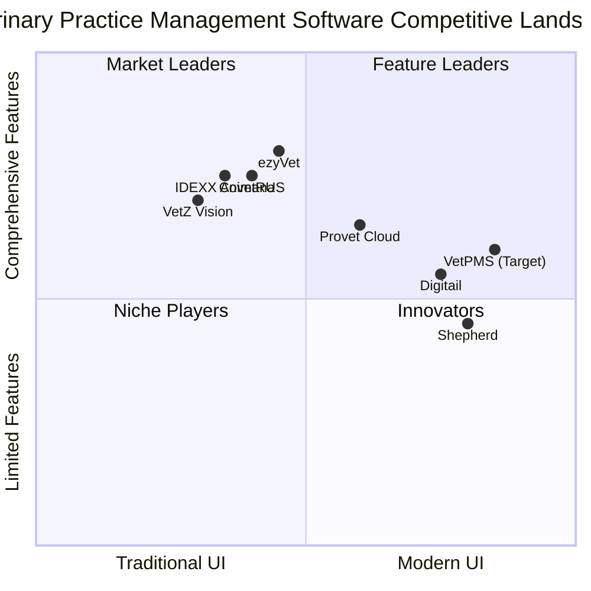

# VetPMS: Global Veterinary Practice Management Software Market Research

## Executive Summary

This report presents comprehensive market research on the global veterinary practice management software (VPMS) industry, with a particular focus on creating a world-class solution that can launch in the Netherlands and expand across Europe and beyond. The veterinary software market is experiencing robust growth, valued at $1.85 billion in 2023 with projections to reach $3.21 billion by 2032 (CAGR 6.35%). The practice management software segment specifically is valued at approximately $375-404 million in 2024, growing at 7-7.8% CAGR.

Our analysis reveals significant opportunities for VetPMS to disrupt this market by addressing key pain points in existing solutions while incorporating advanced technologies that current market leaders are slow to adopt. By focusing on intuitive role-based interfaces, seamless integration capabilities, and innovative features like AI-powered SOAP notes, VetPMS can position itself as a superior alternative to established players like Animana by IDEXX and Digital, starting in the Netherlands but designed for global scalability.

## 1. Industry Overview

### 1.1 Market Size and Growth Projections

The veterinary practice management software market demonstrates strong growth potential:

- **Current Market Value**: $375-404 million (2024)
- **Projected CAGR**: 7-7.8% (2024-2031)
- **Projected Market Value**: $550-680 million by 2031-2033
- **Broader Veterinary Software Market**: $1.85 billion (2023) growing to $3.21 billion by 2032

### 1.2 Key Market Drivers

- **Rising Pet Ownership**: Significant increases in pet adoption globally, accelerated by pandemic-related lifestyle changes
- **Increased Animal Healthcare Spending**: Growing expenditure on pet healthcare, including preventive care and specialized treatments
- **Practice Consolidation**: Emergence of corporate groups and franchises requiring multi-location management solutions
- **Technology Integration**: Demand for seamless connections between practice management, diagnostics, and telehealth
- **Regulatory Compliance**: Need for solutions that adapt to different regional healthcare regulations

### 1.3 Regional Market Analysis

- **North America**: Dominates with approximately 35.85% market share, characterized by high technology adoption and consolidation of practices
- **Europe**: Second-largest market with significant growth potential, particularly in Western European countries
- **Netherlands**: Strategic entry point with high veterinary care standards and digital adoption
- **Asia-Pacific**: Fastest-growing region with increasing pet ownership and veterinary infrastructure development

## 2. Market Analysis

### 2.1 Deployment Model Trends

- **Cloud-Based Solutions**: Dominate with 80.92% market share and growing
  - Lower initial investment
  - Automatic updates and maintenance
  - Anywhere accessibility
  - Reduced IT infrastructure requirements
  - Easier integration with other systems
  
- **On-Premise Solutions**: Declining but still preferred in areas with limited internet connectivity or specific regulatory requirements

### 2.2 Market Segmentation

#### 2.2.1 By Practice Type

- **Companion Animal Practices**: Largest segment with highest growth rate
- **Mixed Animal Practices**: Require more versatile solutions
- **Equine Specialists**: Need specific features for unique workflows
- **Food Animal Practices**: Focus on production medicine and herd health
- **Emergency/Specialty Clinics**: Require advanced scheduling and specialized medical records

#### 2.2.2 By Practice Size

- **Solo Practitioners**: Need cost-effective, easy-to-implement solutions
- **Small Practices (2-5 veterinarians)**: Balance of features and affordability
- **Mid-sized Practices (6-15 veterinarians)**: More complex workflows and reporting needs
- **Large Practices/Hospitals (16+ veterinarians)**: Enterprise-level features including multiple location management
- **Corporate Groups/Franchises**: Multi-location management with standardized protocols

### 2.3 Key Technology Trends

- **AI Integration**: Growing at nearly 25% CAGR within veterinary software
  - AI-powered SOAP notes generation
  - Predictive analytics for business intelligence
  - Enhanced diagnostic support
  
- **Mobile Adoption**: Increasing demand for mobile-first or responsive solutions
  - Veterinarian mobility within the facility
  - Remote access to records
  - Client-facing mobile applications
  
- **Telehealth**: Expanding at 19.65% CAGR
  - Video consultation capabilities
  - Remote monitoring integration
  - Digital triage tools
  
- **Integration Ecosystems**: Demand for platforms that connect with:
  - Diagnostic equipment (imaging, laboratory)
  - Pharmacy/inventory systems
  - Financial/accounting software
  - Client communication platforms
  - Pet insurance providers

## 3. Competitor Landscape

### 3.1 Global Leaders

#### 3.1.1 IDEXX (Animana, ezyVet, Cornerstone)

**Strengths:**
- Strong market presence, particularly in Europe
- Comprehensive integrated laboratory services
- Cloud-based and on-premise options
- Multiple software options targeting different segments

**Weaknesses:**
- Perceived as expensive with complex pricing structures
- Older interfaces in some products (especially Cornerstone)
- Challenging learning curve reported by users
- Limited customization options

#### 3.1.2 Covetrus (eVetPractice, AVImark)

**Strengths:**
- Strong integration with supply ordering
- Wide adoption in North America
- Practice insights and analytics

**Weaknesses:**
- Less presence in European markets
- Older user interface in some products
- Mixed customer service reviews

#### 3.1.3 VetZ (Vision VPM)

**Strengths:**
- Strong European presence, particularly in German-speaking countries
- Comprehensive medical record capabilities
- Integration with laboratory services

**Weaknesses:**
- Limited presence outside Europe
- Traditional interface design
- Less robust mobile capabilities

#### 3.1.4 Provet Cloud (by Finnish Net Solutions)

**Strengths:**
- Modern cloud platform with European focus
- Strong multi-location capabilities
- Customizable workflows

**Weaknesses:**
- Limited market penetration outside Nordics and UK
- Fewer third-party integrations
- Limited business intelligence features

### 3.2 Emerging Innovators

#### 3.2.1 Digitail

**Strengths:**
- Modern, mobile-first approach
- Strong pet parent engagement tools
- AI features for workflow optimization

**Weaknesses:**
- Limited history in the market
- Still developing depth of features
- Less robust reporting capabilities

#### 3.2.2 Shepherd

**Strengths:**
- Intuitive, modern interface
- Strong client communication tools
- Real-time inventory tracking

**Weaknesses:**
- Limited market presence
- Less extensive feature set for specialty practices
- Geographic limitations

### 3.3 Netherlands Market Focus

The Netherlands veterinary software market is predominantly served by:

- **IDEXX Animana**: Market leader with strong local presence
- **VetZ Vision**: Significant market share
- **Provet Cloud**: Growing presence
- **Several local solutions**: With limited feature sets

**Note**: Digital is recognized as a significant competitor globally, but specific information about its features, market share, and presence in the Netherlands requires further investigation through primary research.

## 4. Target Audience Analysis

### 4.1 Key User Personas

#### 4.1.1 Veterinarians

**Primary Needs:**
- Efficient medical record documentation
- Quick access to patient history and diagnostics
- Clinical decision support
- Time-saving tools
- Mobile access

**Pain Points:**
- Time-consuming documentation
- Inefficient workflows
- Limited integration with diagnostic tools
- Poor user experience in existing systems

#### 4.1.2 Veterinary Technicians/Nurses

**Primary Needs:**
- Treatment/medication administration tracking
- Efficient patient monitoring documentation
- Task management
- Clear communication with veterinarians

**Pain Points:**
- Duplicate data entry
- Unclear task assignments
- Complex interfaces
- Limited mobile functionality

#### 4.1.3 Reception/Front Desk Staff

**Primary Needs:**
- Efficient appointment scheduling
- Client communication management
- Invoicing and payment processing
- Quick access to client/patient information

**Pain Points:**
- Complex scheduling interfaces
- Inefficient client check-in/check-out
- Limited client communication tools
- Poor inventory/service item search

#### 4.1.4 Practice Managers

**Primary Needs:**
- Business performance analytics
- Staff scheduling and management
- Inventory control
- Financial reporting

**Pain Points:**
- Limited customizable reports
- Inadequate multi-location management
- Poor inventory control features
- Limited staff performance tracking

#### 4.1.5 Corporate/Franchise Leadership

**Primary Needs:**
- Multi-location standardization and oversight
- Comparative performance analytics
- Centralized protocol management
- Enterprise-level reporting

**Pain Points:**
- Inconsistent data across locations
- Limited multi-tenant architecture
- Inadequate role-based permission systems
- Poor enterprise reporting capabilities

### 4.2 Practice Type Requirements

#### 4.2.1 Solo/Small Practices

- Affordable, straightforward solutions
- Ease of implementation and maintenance
- Limited IT requirements
- Core functionality focus

#### 4.2.2 Mid-sized Practices

- Scalability as practice grows
- More advanced reporting
- Multiple user management
- Customizable workflows

#### 4.2.3 Large Hospitals/Corporate Groups

- Enterprise-level user management
- Multi-location capabilities
- Standardized protocols
- Advanced analytics and business intelligence
- API availability for custom integrations

## 5. Advanced Feature Analysis

### 5.1 AI-Powered SOAP Notes Integration

AI-powered SOAP note generation represents a significant opportunity for innovation in veterinary practice management:

#### 5.1.1 Leading Solutions

- **ScribbleVet**: Automatic transcription to SOAP notes with customizable templates
- **VetSOAP**: Veterinarian-created solution with high accuracy rates
- **CoVet**: Comprehensive AI scribe app with multi-patient capabilities
- **Scribenote**: Speech-to-structured-notes solution
- **Sync**: Audio-to-text with AI assistant modules

#### 5.1.2 Key Benefits

- Time savings of 1-2 hours daily per veterinarian
- Improved work-life balance
- Enhanced client interactions
- Higher quality documentation
- Reduced administrative burden

#### 5.1.3 Integration Potential

- Bidirectional communication with practice management system
- Integration with medical knowledge databases
- Automated coding and billing from documentation
- Clinical decision support opportunities

### 5.2 Context-Aware/Role-Based UI Adaptation

Modern software is moving toward interfaces that adapt based on user role and context:

#### 5.2.1 Role-Specific Interfaces

- **Veterinarians**: Focus on medical records, diagnostics, and treatment planning
- **Technicians**: Emphasis on treatment administration and monitoring
- **Reception**: Scheduling and client management centricity
- **Practice Managers**: Analytics and operational tools prominence

#### 5.2.2 Context-Aware Adaptations

- Day view vs. week view depending on role
- Priority information display based on current tasks
- Simplified vs. detailed views based on user experience level
- Mobile-optimized interfaces for on-the-go access

### 5.3 Multi-Tenant Architecture for Franchise Model

Modern cloud-based platforms leverage multi-tenant architecture to support franchise and corporate practice models:

#### 5.3.1 Key Capabilities

- Centralized configuration with location-specific customizations
- Enterprise-wide reporting and analytics
- Standardized protocols with compliance tracking
- Centralized client/patient databases with appropriate access controls
- Global vs. local inventory management

#### 5.3.2 Implementation Approaches

- Single database with tenant identifiers
- Schema-based multi-tenancy
- Container-based isolation for larger enterprises
- Hybrid approaches for optimal performance and security

## 6. Integration Strategy Analysis

### 6.1 Backend Integration Options

#### 6.1.1 Integration with Animana Backend

**Approach:**
- API-based integration with Animana's backend services
- Data synchronization layer between VetPMS and Animana
- Credential passthrough or OAuth authentication

**Challenges:**
- Limited documentation or restricted API access
- Potential performance constraints
- Data model differences
- Maintaining compatibility with updates

#### 6.1.2 Third-Party Integration Priorities

- **Laboratory Systems**: IDEXX, Zoetis, in-house analyzers
- **Imaging Systems**: DR, ultrasound, CT/MRI viewers
- **Pharmacy/Inventory**: Auto-ordering, controlled substance tracking
- **Financial Systems**: Accounting software, payment processors
- **Client Communication**: SMS, email, app notifications
- **Specialized Tools**: Anesthesia monitoring, dental charting

### 6.2 Technical Architecture Considerations

#### 6.2.1 API-First Design

- RESTful API with comprehensive documentation
- GraphQL for flexible data querying
- Webhook support for event-driven architecture
- SDK for third-party developers

#### 6.2.2 Microservices Architecture

- Independently deployable services
- Scalable components based on demand
- Easier maintenance and updates
- Better fault isolation

## 7. Key Findings

Based on our comprehensive market analysis, we have identified several critical insights that should guide VetPMS development:

### 7.1 Market Opportunity Areas

1. **Modern UX Gap**: Existing solutions (especially market leaders) have dated, unintuitive interfaces that frustrate users. A truly modern, role-optimized interface would be a significant differentiator.

2. **AI Integration Lag**: Despite the clear benefits of AI for documentation and clinical decision support, few established vendors have fully embraced these technologies, creating an opportunity for disruption.

3. **Multi-Location Management**: As veterinary practices consolidate into groups and franchises, there is increasing demand for solutions that effectively balance centralized control with local flexibility.

4. **Mobile Optimization**: Current solutions offer limited mobile experiences, despite the growing demand for on-the-go access to practice information.

5. **Integration Ecosystem**: The ability to seamlessly connect with other systems (diagnostic equipment, financial software, client communication tools) represents a significant competitive advantage.

### 7.2 Critical Success Factors

1. **Intuitive User Experience**: Role-based interfaces that minimize clicks and cognitive load

2. **Time-Saving Automation**: AI-powered documentation, automated client communications, and intelligent scheduling

3. **Flexible Architecture**: Supporting both solo practices and enterprise/franchise models

4. **Data-Driven Insights**: Actionable business intelligence and clinical analytics

5. **Seamless Integrations**: Both with existing systems (like Animana) during transition and with broader veterinary technology ecosystem

### 7.3 Competitive Positioning Opportunities

1. **Modernization Leader**: Position as the most modern, user-friendly solution in a market dominated by legacy systems

2. **Efficiency Champion**: Focus on documented time savings and return on investment through automation

3. **AI Innovator**: Emphasize AI-powered features that reduce administrative burden and improve clinical outcomes

4. **Enterprise Enabler**: Target growing corporate/franchise segment with superior multi-location capabilities

5. **Smooth Transition Specialist**: Highlight ability to work with existing backends (like Animana) for gradual migration

## 8. Strategic Recommendations

Based on our market analysis, we recommend the following strategic priorities for VetPMS development:

### 8.1 Product Development Priorities

1. **Focus on Core Differentiators**: 
   - Role-optimized, intuitive UI with no traditional sidenav/topnav
   - AI-powered SOAP notes integration
   - Dynamic, intelligent scheduling system
   - Context-aware interface adaptation

2. **MVP Feature Set**:
   - Dashboard with role-specific views
   - Appointment scheduling with intelligent conflict avoidance
   - Basic client/patient management
   - Flexible UI framework supporting role-based adaptation
   - Animana backend integration layer

3. **Post-MVP Roadmap**:
   - Advanced AI documentation capabilities
   - Multi-location management
   - Business intelligence and analytics
   - Expanded integration ecosystem
   - Native mobile applications

### 8.2 Market Entry Strategy

1. **Initial Target**: Netherlands veterinary practices currently using Animana
   - Lower barrier to entry through backend integration
   - Focus on user experience improvement without data migration concerns

2. **Expansion Strategy**:
   - Develop full backend capabilities for practices wanting to completely switch
   - Target other European markets with similar practice patterns
   - Pursue multi-location groups and franchises as strategic customers

3. **Differentiation Messaging**:
   - "The modern interface for veterinary teams"
   - "50% less time on documentation, 100% more time for care"
   - "The first practice management system designed for how you actually work"

### 8.3 Technical Implementation Recommendations

1. **Architecture**:
   - React frontend with Tailwind CSS for modern, responsive UI
   - C#/.NET Core backend with microservices architecture
   - PostgreSQL database with schema-based multi-tenancy
   - GraphQL API layer for flexible data access

2. **Integration Approach**:
   - Develop API adapter for Animana backend
   - Create abstraction layer allowing backend switching
   - Implement webhook system for real-time updates

3. **Development Prioritization**:
   - Focus on UI/UX excellence as primary differentiator
   - Leverage existing solutions for non-core functionality
   - Build with scalability and multi-tenancy from the start

## 9. Appendices

### 9.1 Market Size Data Sources

- Grand View Research (2024)
- Market Research Future (2023)
- Precedence Research (2023)
- Coherent Market Insights (2024)

### 9.2 Competitor Feature Comparison Matrix

| Feature | Animana | ezyVet | Provet Cloud | Digitail | VetPMS (Target) |
|---------|---------|--------|-------------|----------|----------------|
| Cloud-Based | ✓ | ✓ | ✓ | ✓ | ✓ |
| On-Premise Option | ✗ | ✗ | ✗ | ✗ | ✗ |
| Mobile App | Limited | Limited | ✓ | ✓ | ✓ |
| Multi-Location Support | ✓ | ✓ | ✓ | Limited | ✓ |
| Role-Based UI | Limited | Limited | Limited | Partial | ✓ |
| AI Documentation | ✗ | ✗ | ✗ | Limited | ✓ |
| Intelligent Scheduling | Limited | Limited | Limited | Partial | ✓ |
| API Availability | Limited | ✓ | ✓ | Limited | ✓ |
| Third-Party Integrations | Moderate | High | Moderate | Limited | High |
| Dutch Language Support | ✓ | ✓ | ✓ | Partial | ✓ |

### 9.3 SWOT Analysis for VetPMS

#### Strengths
- Modern, intuitive UI/UX focus
- Role-based interface adaptation
- AI integration for time-saving
- Ability to work with existing Animana backend
- C#/.NET core foundation for stability and performance

#### Weaknesses
- New entrant in established market
- Limited initial feature set compared to mature products
- Small initial development team
- No established brand recognition
- Bootstrapped funding limiting initial marketing

#### Opportunities
- Growing dissatisfaction with legacy interfaces
- Increasing consolidation creating demand for multi-location solutions
- Rising acceptance of cloud solutions
- Limited AI adoption by established competitors
- Growing Netherlands and European veterinary market

#### Threats
- Potential API limitations from existing providers
- Market consolidation reducing number of potential clients
- Competitor response with UI improvements
- Resource constraints compared to established players
- Potential economic downturn affecting technology investments

### 9.4 Competitive Quadrant Chart

