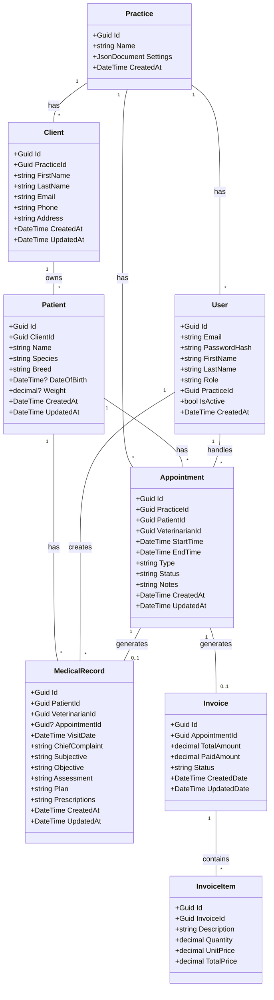

# VetPMS MVP Class Diagram

This simplified class diagram represents the MVP domain model, focusing only on essential entities and relationships needed for the minimum viable product.



## Key Differences from Full System

The MVP class diagram simplifies the architecture by:

1. **Removing Multi-tenant Hierarchy**: No franchise/department structure, just single practice
2. **Simplifying User Management**: Single role per user instead of complex role-permission system
3. **Basic Medical Records**: Text-based prescriptions instead of complex prescription management
4. **Simplified Appointments**: No resource management or complex scheduling
5. **No Integration Framework**: Direct database operations instead of integration hub
6. **Basic Billing**: Simple invoice structure without complex payment processing

## MVP Entity Details

### User
- Simple authentication with email/password
- Single role (Admin, Veterinarian, Receptionist)
- Belongs to one practice

### Practice
- Basic settings stored as JSON
- No multi-location support

### Client
- Basic contact information
- Can have multiple patients

### Patient
- Essential demographics only
- Weight as simple decimal value

### Appointment
- Basic scheduling with start/end times
- Simple status tracking
- No resource allocation

### MedicalRecord
- SOAP format stored as text fields
- Prescriptions as simple text
- Optional link to appointment

### Invoice
- Simple invoice with line items
- Basic status tracking
- Manual payment recording

## Data Access Patterns

The MVP uses a simple repository pattern with Entity Framework Core:

```csharp
public interface IRepository<T> where T : class
{
    Task<T> GetByIdAsync(Guid id);
    Task<IEnumerable<T>> GetAllAsync();
    Task<T> AddAsync(T entity);
    Task UpdateAsync(T entity);
    Task DeleteAsync(Guid id);
}

public class AppointmentRepository : IRepository<Appointment>
{
    private readonly ApplicationDbContext _context;

    public async Task<IEnumerable<Appointment>> GetByDateAsync(DateTime date)
    {
        return await _context.Appointments
            .Where(a => a.StartTime.Date == date.Date)
            .Include(a => a.Patient)
            .OrderBy(a => a.StartTime)
            .ToListAsync();
    }
}
```

This simplified architecture allows for rapid development while providing a foundation for future expansion to the full system architecture.
