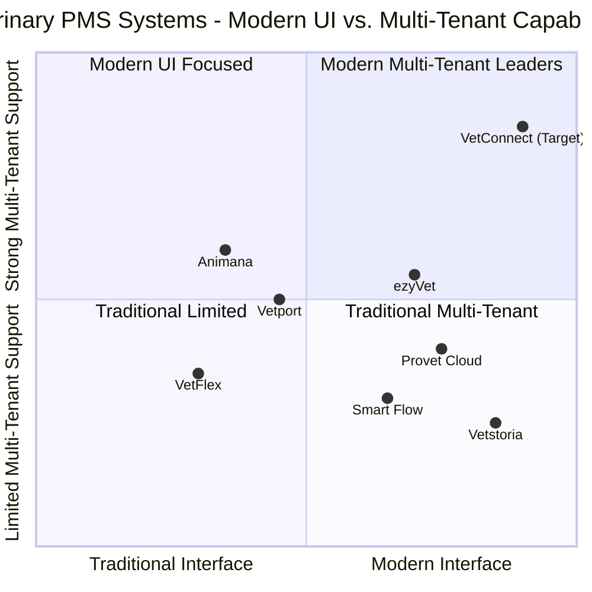

# Product Requirements Document: VetConnect PMS

**Project Name:** VetConnect (vet_connect)
**Date:** April 14, 2025
**Author:** Emma, Product Manager

## Requirements Summary

Create a modern Practice Management System (PMS) for veterinarians with primary focus on the Dutch market. The system needs to offer a modern, intuitive interface design that moves away from traditional navigation elements. Initial MVP should include a dashboard, dynamic appointment scheduler, and client/patient management functionality while supporting multi-tenancy for franchise operations. The system must be able to integrate with Animana by Idexx initially for backend services, with the ability to transition to our own backend in the future.

## Table of Contents

1. [Product Definition](#1-product-definition)
2. [Market Analysis](#2-market-analysis)
3. [Technical Specifications](#3-technical-specifications)
4. [UI/UX Guidelines](#4-uiux-guidelines)
5. [Development Roadmap](#5-development-roadmap)

## 1. Product Definition

### 1.1 Product Goals

1. Create a veterinary PMS with a modern, intuitive UI that eliminates traditional navigation constraints while optimizing workflow efficiency
2. Develop a system that initially integrates with Animana backend but can transition to our own backend when ready
3. Build a scalable multi-tenant platform that supports franchise operations with centralized knowledge and standardized processes

### 1.2 User Stories

1. **As a veterinary receptionist**, I want an intuitive scheduling system that automatically suggests appropriate appointment durations and resources, so that I can efficiently book appointments without creating bottlenecks.

2. **As a veterinarian**, I want critical patient information presented clearly without clutter, so that I can quickly make informed clinical decisions during consultations.

3. **As a practice manager**, I want real-time visibility into clinic operations across multiple locations, so that I can optimize staffing and resource allocation.

4. **As a veterinary nurse/paravet**, I want guided workflows that define my role clearly, so that I can work independently within my scope while knowing when to involve a veterinarian.

5. **As a franchise owner**, I want centralized management of settings, protocols, and knowledge, so that I can ensure consistency across all practice locations.

### 1.3 Competitive Analysis

#### Animana by Idexx

**Pros:**
- Well-established in Dutch market with strong brand recognition
- Comprehensive feature set covering most veterinary practice needs
- Integration with IDEXX laboratory services and diagnostic equipment
- Cloud-based architecture with solid security measures

**Cons:**
- Traditional interface design with standard navigation elements
- Limited support for paravet workflow optimization
- Manual processes in medication management and inventory control
- Limited multi-tenant capabilities for franchise operations

#### ezyVet

**Pros:**
- Modern cloud-based platform with improved user interface
- Strong reporting and analytics capabilities
- Comprehensive API for third-party integrations
- Patient portal and client communication features

**Cons:**
- Higher price point compared to competitors
- Steeper learning curve for staff transitioning from legacy systems
- Limited presence in the Dutch market
- Not optimized for franchise operations

#### Provet Cloud

**Pros:**
- Clean, modern user interface
- Strong focus on workflow optimization
- Cloud-based architecture with regular updates
- Growing European market presence

**Cons:**
- Limited customization options for individual practice needs
- Not specifically designed for franchise operations
- Integration limitations with some third-party services
- Less established in Dutch market

#### Vetstoria

**Pros:**
- Excellent online booking system
- Strong focus on client communication
- Integration capabilities with various PMS systems
- Modern, client-facing interfaces

**Cons:**
- Not a full PMS solution (primarily booking and client engagement)
- Limited clinical record functionality
- Requires integration with other systems for complete practice management
- No multi-tenant capabilities for franchise management

#### Smart Flow (by IDEXX)

**Pros:**
- Excellent workflow management for inpatient care
- Strong electronic treatment sheet functionality
- Integration with Animana and other IDEXX products
- Mobile-friendly design

**Cons:**
- Focused primarily on inpatient workflow rather than complete practice management
- Limited outpatient scheduling capabilities
- Not designed as a standalone PMS solution
- Limited franchise management capabilities

#### Vetport

**Pros:**
- Comprehensive feature set and practice management tools
- Cloud-based system with mobile access
- Telemedicine and client portal features
- Strong inventory management

**Cons:**
- Less presence in European/Dutch markets
- Traditional interface design in some areas
- Limited multi-location management features
- Less focus on workflow optimization

#### VetFlex (Local Dutch System)

**Pros:**
- Tailored to Dutch veterinary market
- Dutch language support and localized features
- Familiarity among Dutch practices
- Compliance with local regulations

**Cons:**
- Smaller development team and slower feature releases
- Less modern interface compared to international competitors
- Limited support for multi-location practices
- Fewer integration options with international vendors

### 1.4 Competitive Quadrant Chart

## 2. Market Analysis

### 2.1 Target Market

The primary target market is veterinary practices in the Netherlands, with a specific focus on:

1. **Franchise veterinary groups** with multiple locations requiring centralized management
2. **Mid-sized independent practices** looking to modernize their operations
3. **Larger veterinary hospitals** with complex workflows and multiple departments
4. **Current Animana users** seeking a more modern interface while maintaining backend compatibility

### 2.2 Market Trends

1. **Growth in veterinary franchises**: Consolidation in the veterinary market has led to larger franchise networks requiring sophisticated multi-location management tools

2. **Increased focus on efficiency**: Rising operational costs are pushing practices to optimize workflows and maximize staff productivity

3. **Shift to cloud-based solutions**: Movement away from on-premise software to cloud-based systems with anywhere access

4. **AI integration**: Growing demand for AI-assisted clinical decision support and workflow automation

5. **Client expectations**: Pet owners increasingly expect digital engagement options similar to human healthcare

6. **Staff shortages**: Veterinary practices face challenges recruiting qualified staff, making efficiency and optimal resource utilization critical

### 2.3 Market Requirements

1. **Dutch language support**: Full localization for the Dutch market, including language, date formats, and financial regulations

2. **VAT compliance**: Support for Dutch tax regulations and reporting requirements

3. **Data privacy**: Compliance with GDPR and Dutch healthcare data protection requirements

4. **Local integrations**: Support for Dutch payment systems, insurance providers, and local laboratory services

5. **Multi-tenant architecture**: Support for franchise operations common in the Dutch veterinary market

## 3. Technical Specifications

### 3.1 Requirements Analysis

Based on the input requirements and market research, VetConnect PMS must address the following core areas:

1. **Modern, intuitive interface**: Moving away from traditional navigation patterns to create a more efficient and user-friendly experience

2. **Core functionality**: Dashboard, appointment scheduling, and client/patient management as the foundation of the MVP

3. **Animana backend integration**: Initial compatibility with Animana for practices transitioning gradually

4. **Multi-tenancy support**: Architecture supporting franchise operations with centralized management

5. **Role-based access**: Granular permissions and customized views based on user roles

### 3.2 Technology Stack

**Frontend:**
- React for UI components and state management
- Tailwind CSS for styling and responsive design
- Redux for global state management
- React Query for data fetching and caching

**Backend:**
- C#/.NET Core for API services
- ASP.NET Core Web API for RESTful endpoints
- Entity Framework Core for data access

**Database:**
- PostgreSQL as primary database
- Redis for caching and session management

**Infrastructure:**
- Docker for containerization
- Kubernetes for container orchestration
- Azure Cloud for hosting (primary)

**Authentication/Authorization:**
- OAuth 2.0 and OpenID Connect for authentication
- Role-Based Access Control (RBAC) with tenant isolation

### 3.3 Requirements Pool

#### P0 (Must-have for MVP)

1. **Modern Dashboard**
   - Real-time clinic activity overview
   - Key performance indicators and metrics
   - Actionable task lists and notifications
   - Role-specific views and widgets

2. **Dynamic Appointment Scheduler**
   - Intelligent scheduling with automatic duration calculation
   - Resource management (rooms, equipment, staff)
   - Visual calendar with drag-and-drop functionality
   - Client self-scheduling options

3. **Client and Patient Management**
   - Comprehensive client profiles with multiple contact methods
   - Multi-pet household management
   - Medical history and visit records
   - Document and image storage
   - Automated reminders and follow-ups

4. **Animana Backend Integration**
   - API-based connectivity to Animana services
   - Data synchronization between systems
   - Fallback mechanisms for service interruptions

5. **Multi-tenant Architecture**
   - Data isolation between practice locations
   - Tenant-specific configurations and settings
   - Cross-tenant reporting and management

6. **Role-based Access Control**
   - Granular permission settings by role
   - Custom role definitions
   - Activity logging and audit trails

#### P1 (Should-have for complete solution)

1. **Paravet Workflow Optimization**
   - Guided task workflows for paravet staff
   - Clear handoff points to veterinarians
   - Protocol-driven processes with checklists

2. **Enhanced Medical Records**
   - Structured data entry with templates
   - Voice-to-text dictation for notes
   - AI-assisted clinical documentation
   - Automatic error checking and validation

3. **Inventory and Medication Management**
   - Barcode scanning for inventory control
   - Batch and expiration date tracking
   - Automated reordering and stock alerts
   - Dispensing verification workflows

4. **Billing and Payment Processing**
   - Automated invoice generation
   - Integrated payment terminal support
   - Insurance claim processing
   - Financial reporting and reconciliation

5. **Client Communication Tools**
   - Two-way messaging platform
   - Automated appointment reminders
   - Post-visit care instructions
   - Satisfaction surveys and feedback collection

#### P2 (Nice-to-have for future versions)

1. **AI-powered Clinical Support**
   - Diagnostic suggestion engine
   - Treatment protocol recommendations
   - Anomaly detection in patient data

2. **Advanced Analytics and Reporting**
   - Business intelligence dashboards
   - Custom report generation
   - Predictive analytics for business planning

3. **Telemedicine Integration**
   - Video consultation capabilities
   - Remote patient monitoring
   - Digital prescription services

4. **Client Portal and Mobile App**
   - Self-service appointment booking
   - Medical record access
   - Prescription refill requests
   - Secure messaging with practice

5. **Laboratory and Diagnostic Integration**
   - Direct integration with lab equipment
   - DICOM support for imaging
   - Digital radiology management
   - Test result trending and analysis

### 3.4 UI Design Draft

**Dashboard Layout**

The dashboard will feature a card-based layout with:
- Activity timeline in the center showing upcoming appointments and recent activities
- Quick-access action buttons for common tasks (new appointment, new client, etc.)
- Key metrics displayed in visually distinct widgets
- Patient/client search with multi-factor identification
- Role-specific information based on user type

**Appointment Scheduler**

The scheduler will utilize:
- Timeline view with color-coding by appointment type
- Resource allocation visualization (rooms, staff)
- Quick-edit functionality for appointment details
- Contextual information on hover for appointment details
- Intelligent conflict detection and resolution

**Client/Patient Management**

The client/patient view will feature:
- Unified client/household view with clear patient differentiation
- Timeline-based medical history visualization
- Tabbed interface for different aspects of patient care
- Contextual action buttons that appear based on current workflow
- Quick-access to relevant client communication tools

### 3.5 Open Questions

1. **Animana Integration Depth**
   - What specific Animana APIs are available for integration?  
   - Are there any limitations on data access or modification through these APIs?
   - What authentication mechanisms are required for Animana integration?

2. **Multi-tenant Granularity**
   - What level of data sharing vs. isolation is required between franchise locations?
   - How should central management vs. local autonomy be balanced?
   - What franchise-level analytics and reporting are needed?

3. **Migration Strategy**
   - What is the optimal path for data migration from Animana to our backend?
   - Should migration be all-at-once or can it be done in phases by module?
   - What historical data must be preserved vs. what can be archived?

4. **Custom Workflows**
   - How much workflow customization should be available to individual practices?
   - Should templates be managed centrally or at the practice level?
   - How can workflow changes be tested before deployment across a franchise?

5. **Regulatory Compliance**
   - Are there specific Dutch veterinary regulatory requirements that must be addressed?
   - How should drug prescribing and controlled substance management be handled?
   - What audit trails are required for regulatory compliance?

## 4. UI/UX Guidelines

### 4.1 Design Principles

The VetConnect PMS will follow these core design principles:

1. **Contextual Navigation**: Replace traditional menu structures with context-aware navigation that presents options based on the user's current task and role

2. **Progressive Disclosure**: Display information and options progressively as needed, reducing cognitive load and screen clutter

3. **Spatial Memory**: Leverage consistent spatial positioning to help users build muscle memory for common actions

4. **Visual Hierarchy**: Use color, size, and positioning to guide attention to the most important information and actions

5. **Streamlined Workflows**: Design workflows that minimize clicks and screen transitions to complete common tasks

### 4.2 Navigation Approach

Instead of traditional sidenav or topnav elements, VetConnect will implement:

1. **Action-Oriented Hub**: A central dashboard acting as a hub with quick-access to common actions and workflows

2. **Contextual Action Panels**: Dynamic action panels that appear based on the current context (patient view, scheduling, etc.)

3. **Breadcrumb Trails**: Visual indication of navigation path and easy backward navigation

4. **Quick Access Toolbar**: Persistent access to frequently used functions, customizable by user

5. **Search-Driven Navigation**: Powerful global search as a primary navigation method, with type-ahead suggestions and deep linking

### 4.3 Visual Design

1. **Color Scheme**:
   - Primary: #3B82F6 (Blue) - Main brand color
   - Secondary: #10B981 (Green) - Action and success indicators
   - Accent: #8B5CF6 (Purple) - Highlights and focus elements
   - Neutral: #1F2937 (Dark Gray) - Text and UI elements
   - Background: #F9FAFB (Light Gray) - Page backgrounds

2. **Typography**:
   - Primary Font: Inter - Clean, modern sans-serif for general UI
   - Secondary Font: DM Sans - For headings and emphasis
   - Monospace: JetBrains Mono - For code and technical information

3. **Component Design**:
   - Rounded corners (8px radius) on cards and containers
   - Subtle shadows for depth and hierarchy
   - Consistent padding and spacing system
   - Minimal use of dividers, relying on whitespace for separation

### 4.4 Responsiveness

1. **Device Support**:
   - Desktop: Primary development target (1280px+ width)
   - Tablet: Full functionality with modified layouts (768px-1279px)
   - Mobile: Essential functions only with simplified interface (320px-767px)

2. **Layout Adaptation**:
   - Fluid grid system with 12 columns
   - Breakpoint-based component reflow
   - Critical content prioritization on smaller screens

### 4.5 Accessibility

1. **WCAG Compliance**:
   - Target WCAG 2.1 AA compliance for all interfaces
   - Regular accessibility audits during development

2. **Inclusive Design**:
   - Sufficient color contrast (minimum 4.5:1 for text)
   - Alternative text for all images and icons
   - Keyboard navigation support throughout
   - Screen reader compatibility

## 5. Development Roadmap

### 5.1 Phase 1: MVP Development (3-4 months)

**Focus Areas:**
- Core dashboard implementation
- Basic appointment scheduling
- Client/patient management fundamentals
- Animana backend integration
- Multi-tenant foundation
- Modern UI framework implementation

**Deliverables:**
- Functional prototype with core features
- Animana integration proof-of-concept
- Initial UI component library

### 5.2 Phase 2: Beta Testing (2-3 months)

**Focus Areas:**
- Partner with 2-3 veterinary clinics for real-world testing
- Refinement of core functionality based on feedback
- Performance optimization and bug fixing
- User training materials development

**Deliverables:**
- Beta release with enhanced stability
- Initial training documentation
- Feedback collection and prioritization framework

### 5.3 Phase 3: Full Release (2 months)

**Focus Areas:**
- P1 feature implementation
- Extended Animana integration capabilities
- Comprehensive testing and quality assurance
- Launch preparation and marketing materials

**Deliverables:**
- Production-ready version 1.0
- Complete user documentation
- Implementation and migration guides
- Support processes and infrastructure

### 5.4 Phase 4: Backend Transition (4-6 months)

**Focus Areas:**
- Development of VetConnect native backend
- Data migration tools and processes
- Gradual feature parity with Animana backend
- Seamless switchover mechanism

**Deliverables:**
- Full-featured independent backend
- Migration toolkit for Animana data
- Backend switching mechanism with minimal disruption
- Extended feature set beyond Animana capabilities

## 6. Multi-Tenancy Architecture

### 6.1 Overview

VetConnect will implement a robust multi-tenancy architecture to support veterinary franchise operations with shared infrastructure while maintaining data isolation between practices.

### 6.2 Data Isolation Model

**Hierarchical Tenant Structure:**
- **Franchise Level** (Top-level tenant): Contains shared settings, protocols, and master data
- **Practice Level** (Sub-tenant): Individual practices within a franchise
- **Department Level** (Optional): Distinct departments within larger practices (e.g., small animals, exotics, etc.)

**Data Segregation Approach:**
- Database schema per tenant with shared application servers
- Tenant identifier embedded in all database queries
- Row-level security enforcement for cross-tenant data access
- Encrypted data storage with tenant-specific encryption keys

### 6.3 Centralized Knowledge Management

**Shared Resources:**
- Treatment protocols and best practices
- Training materials and documentation
- Forms and templates
- Drug formulary and medication guidelines

**Inheritance Model:**
- Franchise-level defaults can be overridden at practice level
- Practice-specific customizations tracked and reportable
- Change management workflow for protocol updates

### 6.4 Cross-Tenant Visibility

**Role-Based Cross-Tenant Access:**
- Franchise administrators: Full visibility across all practices
- Regional managers: Access to assigned group of practices
- Practice managers: Access limited to specific practice

**Aggregated Reporting:**
- Cross-tenant analytics with appropriate access controls
- Benchmark reporting across practices
- Franchise-wide inventory and resource management

## 7. Animana Integration & Migration Path

### 7.1 Integration Architecture

**Frontend-First Approach:**
- Initial deployment as frontend-only application
- API gateway to route requests between VetConnect and Animana
- Bidirectional data synchronization for critical entities

**Integration Points:**
- Client and patient data
- Appointment scheduling
- Medical records
- Billing and invoicing
- User authentication and authorization

### 7.2 Data Transformation Layer

**Entity Mapping:**
- Bidirectional mapping between Animana and VetConnect data models
- Real-time translation of data structures during API calls
- Handling of data format differences and extensions

**Conflict Resolution:**
- Strategies for handling concurrent updates in both systems
- Conflict detection and notification mechanisms
- Manual and automated resolution workflows

### 7.3 Backend Transition Strategy

**Phased Migration Approach:**
1. **Dual System Phase**: VetConnect frontend with Animana backend
2. **Parallel Operations**: VetConnect backend deployed alongside Animana with sync
3. **Module Migration**: Gradual migration of modules to VetConnect backend
4. **Complete Transition**: Full cutover to VetConnect backend with historical data

**Data Migration Tools:**
- ETL processes for historical data import
- Validation and verification utilities
- Rollback capabilities for each migration phase

### 7.4 Operational Considerations

**Transition Support:**
- Training programs for users during transition
- Helpdesk and support resources during migration
- Documentation for dual-system operations

**Performance Monitoring:**
- Real-time monitoring of integration points
- Performance metrics for hybrid operation
- Error detection and notification system

## 8. Innovative UI/UX Approach

### 8.1 Contextual Interface Design

**Activity-Based Workspaces:**
- Dynamic interface organization around user activities rather than system modules
- Context-sensitive toolsets that appear based on current task
- Visual workspace transitions that maintain user orientation

**Fluid Navigation Concept:**
- Elimination of traditional menu hierarchies
- Context-aware action panels that surface relevant options
- Path visualization showing user journey through workflows

### 8.2 Intelligent Assistance

**Predictive Interface Elements:**
- AI-powered suggestions for next actions based on context and past behavior
- Smart defaults for form fields based on patient type, history, and procedure
- Automated task sequencing for common workflows

**Digital Assistant Integration:**
- Natural language processing for command input
- Voice-enabled workflows for hands-free operation during procedures
- Contextual help and guidance based on current activity

### 8.3 Role-Optimized Experiences

**Persona-Based Views:**
- Reception-focused interface emphasizing client management and scheduling
- Veterinarian view prioritizing clinical information and decision support
- Manager view highlighting operational metrics and staff management
- Paravet interface with guided workflows and clear escalation paths

**Customizable Workspaces:**
- User-specific dashboard configuration
- Savable workspace layouts for different contexts
- Preference synchronization across devices

### 8.4 Visual Communication System

**Status Visualization:**
- Color-coding system for appointment types and urgency levels
- Progress indicators for multi-step processes
- At-a-glance practice status overview

**Information Hierarchy:**
- Visual distinction between primary, secondary, and background information
- Progressive disclosure of details to prevent information overload
- Consistent patterns for similar information types across the application

## 9. Implementation Considerations

### 9.1 Development Methodology

**Agile Approach:**
- Two-week sprint cycles
- Regular stakeholder reviews
- Continuous integration and delivery
- Feature flagging for gradual rollout

**User-Centered Process:**
- Embedded user research throughout development
- Usability testing of key workflows
- Beta user feedback incorporation

### 9.2 Quality Assurance

**Testing Strategy:**
- Automated unit and integration testing
- Performance testing under realistic load conditions
- Security testing including penetration testing
- Multi-tenant isolation verification

**Acceptance Criteria:**
- Feature completeness against requirements
- Performance benchmarks for key operations
- Security compliance validation
- Accessibility standards compliance

### 9.3 Deployment Strategy

**Infrastructure:**
- Cloud-based deployment on Azure
- Containerized application components
- Automated scaling based on demand
- Geographic redundancy for high availability

**Release Management:**
- Canary releases for risk mitigation
- Blue-green deployment for zero-downtime updates
- Automated rollback capabilities
- Comprehensive monitoring and alerting

### 9.4 Support and Maintenance

**Support Levels:**
- Tier 1: Basic user assistance and troubleshooting
- Tier 2: Technical problem resolution
- Tier 3: Development team escalation

**Maintenance Windows:**
- Regular update schedule during off-peak hours
- Emergency patch process for critical issues
- Advance notification system for planned maintenance

## 10. Conclusion

VetConnect represents a significant advancement in veterinary practice management software, combining modern design principles with powerful functionality tailored to the Dutch veterinary market. By addressing the key pain points identified in current systems while providing a clear migration path from Animana, VetConnect positions itself as the ideal solution for forward-thinking veterinary practices and franchises.

The implementation of an innovative navigation approach moves beyond traditional interface paradigms to create a more intuitive and efficient user experience. Combined with robust multi-tenant capabilities and a strategic integration approach with Animana, VetConnect will deliver immediate value while setting the foundation for a complete practice management ecosystem.

By prioritizing the core MVP features while establishing a clear roadmap for future enhancements, the development team can deliver a compelling initial product while continuing to build toward the comprehensive vision.
