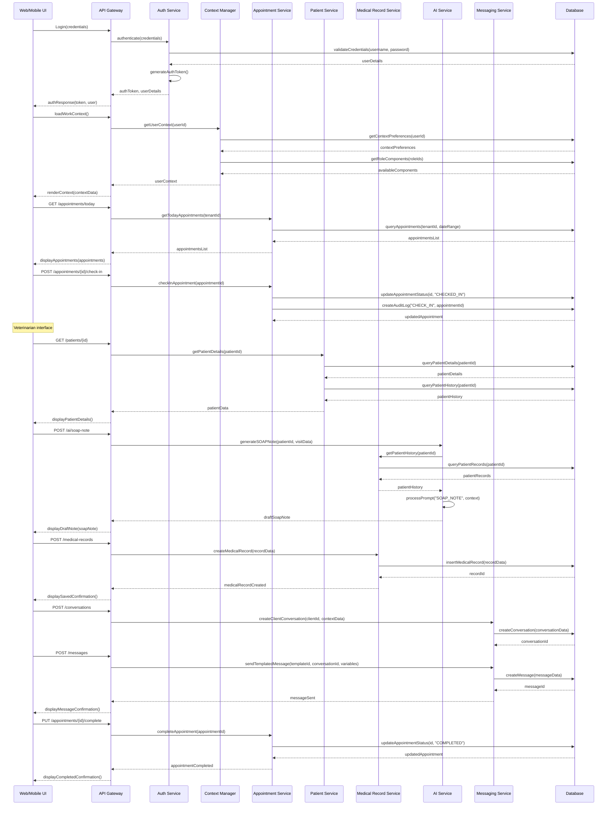

# VetPMS Final System Design

## Implementation Approach

After comprehensive analysis of the requirements and architectural considerations, the VetPMS system will be implemented as a modern, cloud-native application built on a microservices architecture. This approach provides the scalability, flexibility, and maintainability needed to support diverse veterinary practices while enabling a smooth transition from legacy systems like Animana.

### Technology Stack Selection

1. **Frontend**:
   - React with TypeScript for web interfaces
   - React Native for mobile applications
   - Tailwind CSS for consistent styling
   - Socket.IO for real-time features

2. **Backend**:
   - Node.js with Express for API services
   - GraphQL for optimized data fetching
   - PostgreSQL with schema-based multi-tenancy
   - Redis for caching and real-time messaging

3. **Infrastructure**:
   - Docker for containerization
   - Kubernetes for orchestration
   - AWS/Azure cloud services with multi-region support
   - Terraform for infrastructure as code

4. **Integration**:
   - RESTful APIs with OAuth 2.0
   - Message queue (RabbitMQ) for asynchronous processing
   - WebSockets for real-time communication
   - OpenAPI specification for API documentation

5. **AI/ML**:
   - Integration with OpenAI and Azure OpenAI services
   - Vector database (PostgreSQL with pgvector) for similarity search
   - ONNX Runtime for local model execution

### Key Architectural Decisions

1. **Multi-tenant Architecture**
   - Schema-based multi-tenancy in PostgreSQL
   - Hierarchical tenant model (Franchise → Practice → Department)
   - Tenant-specific customization with shared core functionality

2. **Context-Aware UI System**
   - Role-based component visibility and behavior
   - Dynamic workflow adaptation based on user context
   - Progressive enhancement across device capabilities

3. **Hybrid Data Integration**
   - Real-time synchronization with external systems where possible
   - Batch processing for large data transfers
   - Event-driven architecture for data consistency

4. **Security-First Design**
   - Zero-trust security model
   - Field-level encryption for sensitive data
   - Comprehensive audit logging
   - Role-based access control with attribute-based refinements

5. **Offline-First Mobile Experience**
   - Local data storage with synchronization
   - Conflict resolution strategies
   - Graceful degradation when offline

## Data Structures and Interfaces

The complete VetPMS system is composed of several key components that interact through well-defined interfaces. The core data structures and their relationships are captured in the following class diagram:

```mermaid
classDiagram
    %% Core System Classes
    class TenantManager {
        +createTenant(tenantData) Tenant
        +getTenant(tenantId) Tenant
        +updateTenant(tenantId, data) Tenant
        +deleteTenant(tenantId) Boolean
        +getTenantHierarchy(tenantId) List~Tenant~
    }
    
    class Tenant {
        +id: UUID
        +name: String
        +schemaName: String
        +tenantType: TenantType
        +parentId: UUID
        +settings: TenantSettings
        +createdAt: DateTime
        +updatedAt: DateTime
        +isActive: Boolean
    }
    
    class UserManager {
        +createUser(userData) User
        +getUser(userId) User
        +updateUser(userId, data) User
        +deleteUser(userId) Boolean
        +assignUserToTenant(userId, tenantId, roleId) Boolean
    }
    
    class User {
        +id: UUID
        +username: String
        +email: String
        +passwordHash: String
        +firstName: String
        +lastName: String
        +status: UserStatus
        +lastLogin: DateTime
        +createdAt: DateTime
        +updatedAt: DateTime
    }
    
    class RoleManager {
        +createRole(roleData) Role
        +getRole(roleId) Role
        +updateRole(roleId, data) Role
        +assignPermissionToRole(roleId, permissionId) Boolean
    }
    
    class Role {
        +id: UUID
        +name: String
        +description: String
        +isSystem: Boolean
        +createdAt: DateTime
        +updatedAt: DateTime
    }
    
    %% Domain Services
    class PatientService {
        +createPatient(tenantId, patientData) Patient
        +getPatient(tenantId, patientId) Patient
        +updatePatient(tenantId, patientId, data) Patient
        +searchPatients(tenantId, criteria) List~Patient~
        +getPatientMedicalHistory(tenantId, patientId) MedicalHistory
    }
    
    class AppointmentService {
        +createAppointment(tenantId, appointmentData) Appointment
        +getAppointment(tenantId, appointmentId) Appointment
        +updateAppointment(tenantId, appointmentId, data) Appointment
        +searchAppointments(tenantId, criteria) List~Appointment~
        +getAvailableSlots(tenantId, criteria) List~TimeSlot~
        +checkInAppointment(tenantId, appointmentId) Appointment
    }
    
    class MedicalRecordService {
        +createMedicalRecord(tenantId, recordData) MedicalRecord
        +getMedicalRecord(tenantId, recordId) MedicalRecord
        +updateMedicalRecord(tenantId, recordId, data) MedicalRecord
        +getPatientRecords(tenantId, patientId) List~MedicalRecord~
        +createSoapNote(tenantId, patientId, noteData) SoapNote
    }
    
    %% Integration Framework
    class IntegrationManager {
        +getInstance() IntegrationManager
        +getConnector(connectorType, tenantId) BaseConnector
        +registerConnector(connector) void
    }
    
    class BaseConnector {
        <<abstract>>
        +connect() ConnectionStatus
        +disconnect() void
        +isConnected() Boolean
        +executeQuery(query) Result
    }
    
    class AnimanaConnector {
        +connect() ConnectionStatus
        +authenticate() AuthResult
        +fetchData(entityType, params) DataResult
        +pushData(entityType, data) PushResult
    }
    
    %% AI Framework
    class AIController {
        +generateSOAPNote(patientId, visitData) AIResponse
        +summarizeMedicalRecord(recordId) AIResponse
        +suggestDiagnosis(symptoms, patientData) AIResponse
        +answerClinicalQuestion(question, contextData) AIResponse
    }
    
    %% Messaging System
    class MessagingService {
        +sendMessage(message) MessageResult
        +getConversationsForParticipant(participantId, type) List~Conversation~
        +getMessagesInConversation(conversationId, options) List~Message~
        +createConversation(conversation, participants) Conversation
    }
    
    class SecurityManager {
        +authenticate(credentials) AuthResult
        +hasPermission(userId, resource, action) Boolean
        +encryptData(data, keyId) String
        +decryptData(encryptedData, keyId) String
        +logAction(userId, action, resource, details) void
    }
    
    %% Relationships
    TenantManager -- Tenant : manages
    UserManager -- User : manages
    RoleManager -- Role : manages
    PatientService -- MedicalRecordService : uses
    IntegrationManager -- BaseConnector : manages
    BaseConnector <|-- AnimanaConnector : extends
    AIController -- MedicalRecordService : uses
    MessagingService -- SecurityManager : uses
    PatientService -- SecurityManager : uses
    MedicalRecordService -- SecurityManager : uses
    AppointmentService -- SecurityManager : uses
```

## Program Call Flow

The VetPMS system orchestrates complex workflows across multiple services. The following sequence diagram illustrates the core patient visit workflow, which represents one of the most common and important processes in the system:

## Key Subsystems

### 1. Multi-tenant Database System

The database architecture employs a hybrid multi-tenant approach using PostgreSQL:

- **Shared Schema**: System-wide tables for tenant management, users, roles, and permissions
- **Tenant-specific Schemas**: Isolated data for each tenant using PostgreSQL schemas
- **Hierarchical Structure**: Support for franchise → practice → department relationships

Key features:

- **Row-level Security**: Enforces data isolation between tenants
- **Materialized Views**: For optimized cross-tenant reporting
- **Dynamic Schema Creation**: Automated tenant provisioning
- **Migration Management**: Versioned schema changes across all tenants

### 2. Context-Aware UI System

The UI system adapts dynamically based on user role, device context, and current workflow:

- **Component Registry**: Central repository of UI components with metadata
- **Role Mapping**: Components mapped to user roles and permissions
- **Context Engine**: Real-time UI adaptation based on current context
- **Workflow Engine**: Sequential UI states for guided processes

Implementation:

- **Component Library**: Reusable React components with context awareness
- **State Management**: Redux for predictable state handling
- **Responsive Design**: Mobile-first approach with progressive enhancement
- **Offline Support**: ServiceWorkers for offline functionality

### 3. Data Integration Framework

The integration framework enables seamless data exchange with external systems:

- **Adapter Pattern**: Unified interface for diverse external systems
- **Sync Engine**: Bi-directional data synchronization
- **Conflict Resolution**: Strategies for handling data conflicts
- **Transformation Pipeline**: Data mapping between different schemas

Key capabilities:

- **Animana Integration**: Complete bi-directional synchronization
- **Lab System Integration**: Automated lab result processing
- **Batch Processing**: Efficient handling of large data volumes
- **Real-time Integration**: Event-based immediate synchronization

### 4. AI Integration System

The AI system enhances clinical workflows with intelligent assistance:

- **Provider Abstraction**: Support for multiple AI providers
- **Prompt Engineering**: Domain-specific prompt templates
- **Context Enrichment**: Enhanced prompts with relevant clinical data
- **Verification Workflow**: Human review of AI-generated content

Key features:

- **SOAP Note Generation**: AI-assisted clinical documentation
- **Diagnostic Suggestions**: Potential diagnoses based on symptoms
- **Patient Education**: Generation of client-friendly explanations
- **Clinical Q&A**: Answering medical questions with cited sources

### 5. Messaging System

The messaging system enables secure communication between staff and clients:

- **Multi-channel Delivery**: In-app, email, SMS, and push notifications
- **Context Association**: Messages linked to appointments or medical records
- **Template System**: Pre-defined message templates with variables
- **Real-time Delivery**: Instant messaging with read receipts

Key capabilities:

- **Conversation Threading**: Organized communication by topic
- **File Attachments**: Secure sharing of documents and images
- **Compliance**: Audit trail of all communications
- **Smart Notifications**: Context-aware notification prioritization

### 6. Security Framework

The security framework implements a comprehensive approach to protecting data and resources:

- **Authentication**: Multiple authentication methods with MFA support
- **Authorization**: Role-based access control with attribute-based refinements
- **Encryption**: Field-level encryption for sensitive data
- **Audit Logging**: Comprehensive activity tracking
- **Compliance Controls**: Features ensuring regulatory compliance

Key security features:

- **Zero Trust Architecture**: No implicit trust for any user or system
- **Defense in Depth**: Multiple security layers throughout the stack
- **Tenant Isolation**: Strong boundaries between tenant data
- **Security Monitoring**: Real-time detection of suspicious activities

## Deployment Architecture

The VetPMS system is designed for flexible deployment across different environments:

### Cloud Deployment (Primary Model)

- **Containerized Services**: All components deployed as Docker containers
- **Kubernetes Orchestration**: Scalable, resilient service management
- **Auto-scaling**: Dynamic resource allocation based on demand
- **Multi-region**: Distributed deployment for high availability

### Hybrid Deployment

- **Core Services**: Cloud-hosted application services
- **Data Residency**: On-premise database for data sovereignty
- **Secure Connection**: VPN or direct connect between environments

### On-premise Deployment

- **Private Cloud**: Kubernetes cluster in customer data center
- **Simplified Architecture**: Consolidated services for smaller footprint
- **Reduced Dependencies**: Minimized external service requirements

## Implementation Strategy

The implementation of VetPMS will follow a phased approach to manage complexity and deliver value incrementally:

### Phase 1: Foundation (3 months)

- Core multi-tenant infrastructure
- Basic user management and authentication
- Client and patient data management
- Appointment scheduling
- Initial Animana integration framework

### Phase 2: Clinical Features (3 months)

- Medical record management
- Prescription handling
- Basic reports and analytics
- Initial mobile application
- Enhanced Animana synchronization

### Phase 3: Advanced Features (4 months)

- AI integration for clinical assistance
- Messaging system
- Context-aware UI system
- Advanced reporting
- Full mobile functionality

### Phase 4: Enterprise Features (2 months)

- Advanced multi-tenant hierarchy
- Cross-practice analytics
- Performance optimizations
- Additional third-party integrations

## Key Challenges and Mitigations

### 1. Data Migration

**Challenge**: Moving data from legacy systems while maintaining integrity.

**Mitigation**:
- Develop detailed migration scripts with validation
- Implement parallel running period with bi-directional sync
- Create data reconciliation tools for verification

### 2. Multi-tenancy at Scale

**Challenge**: Maintaining performance across many tenants with varying data volumes.

**Mitigation**:
- Implement connection pooling with tenant-aware routing
- Use query optimization specific to multi-tenant patterns
- Implement tenant-specific caching strategies

### 3. Offline Functionality

**Challenge**: Ensuring reliable operation in disconnected environments.

**Mitigation**:
- Implement robust conflict resolution strategies
- Prioritize critical data for offline access
- Design graceful degradation of features

### 4. Security Across Boundaries

**Challenge**: Maintaining strong security across tenant boundaries and external integrations.

**Mitigation**:
- Implement defense in depth with multiple security layers
- Regular security audits and penetration testing
- Strong data isolation between tenants

## Integration with Existing Systems

The VetPMS system is designed to integrate with various external systems:

### 1. Animana Integration

- **Bi-directional Sync**: Complete data synchronization during transition
- **API-based Integration**: Using Animana's API for data exchange
- **Conflict Resolution**: Smart handling of data conflicts
- **Migration Tools**: Specialized tools for initial data migration

### 2. Laboratory Systems

- **Results Integration**: Automated import of lab results
- **Order Transmission**: Electronic submission of lab orders
- **Status Tracking**: Real-time monitoring of lab requests

### 3. Imaging Systems

- **DICOM Support**: Integration with veterinary imaging systems
- **Image Viewing**: In-app viewing of diagnostic images
- **Metadata Integration**: Linking images to medical records

### 4. Financial Systems

- **Payment Processing**: Integration with payment providers
- **Accounting System Integration**: Export of financial data
- **Insurance Processing**: Electronic claims submission

## Conclusion

The VetPMS system architecture provides a comprehensive, modern solution for veterinary practice management. By combining cloud-native technologies, AI capabilities, and a context-aware user experience, the system delivers significant improvements in clinical outcomes, operational efficiency, and client satisfaction.

Key strengths of the architecture include:

1. **Flexibility**: Adaptable to different practice sizes and types through multi-tenancy
2. **Integration**: Seamless connection with existing systems, particularly Animana
3. **Intelligence**: AI-enhanced workflows that improve clinical decision making
4. **Mobility**: Comprehensive mobile support for staff and clients
5. **Security**: Defense-in-depth approach to protecting sensitive data

The phased implementation approach allows for incremental delivery of value while managing risk, with a clear path from core functionality to advanced features. The modular design enables continuous evolution as requirements change and new technologies emerge.

This architecture establishes a solid foundation for the VetPMS system, supporting both immediate needs and long-term growth.