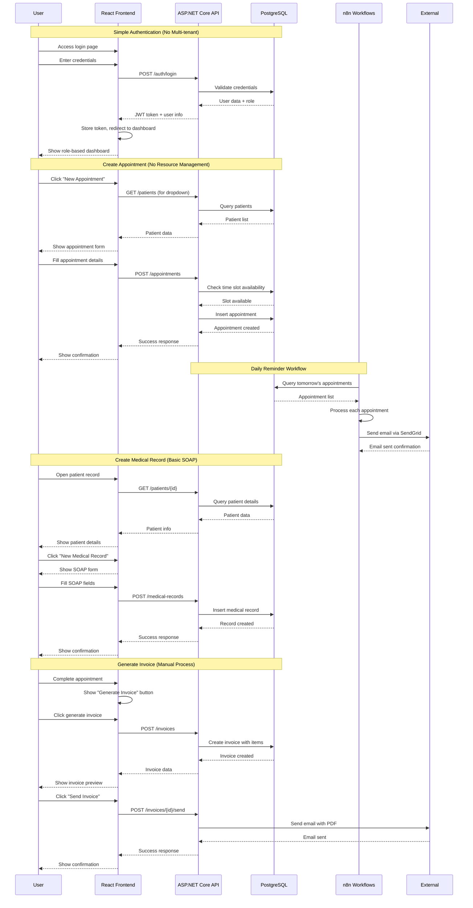
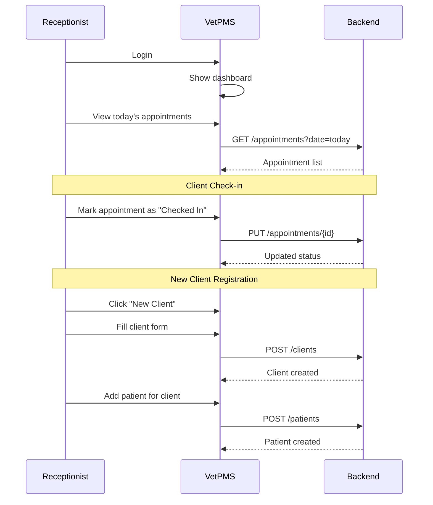
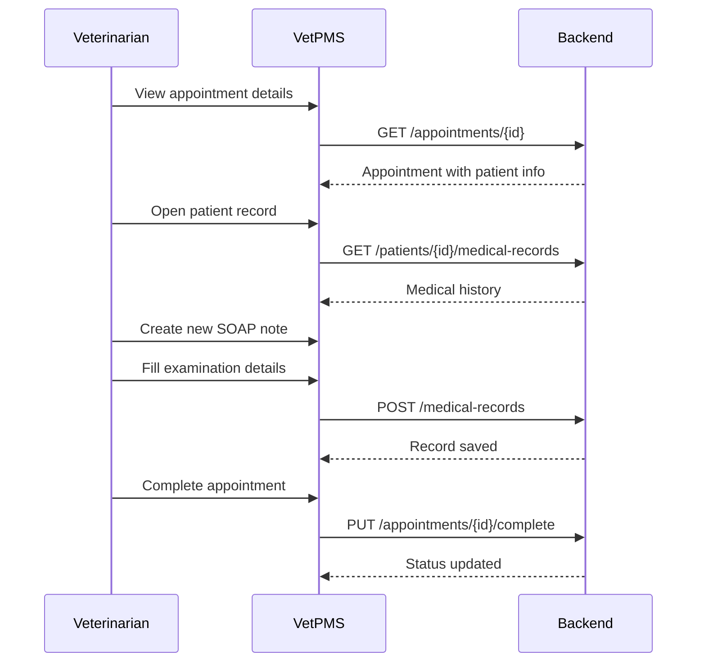
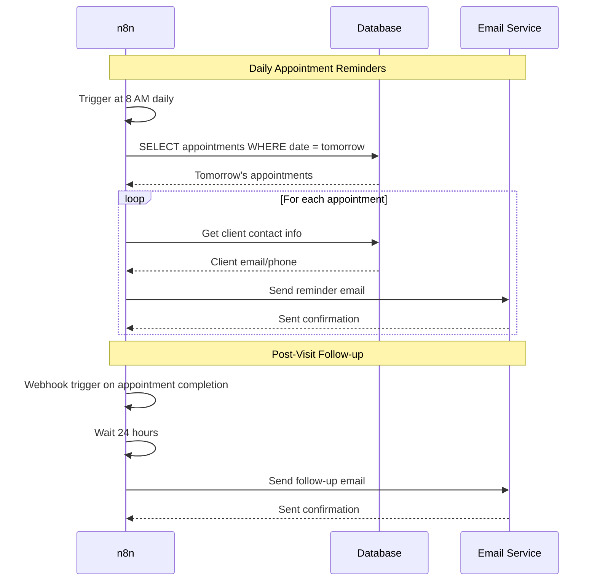
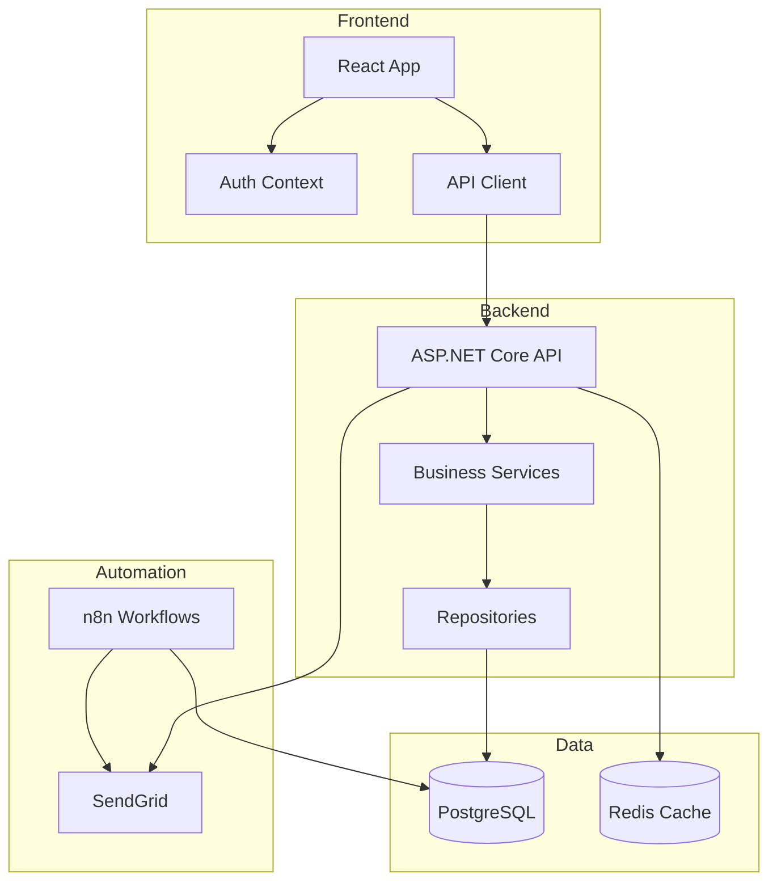

# VetPMS MVP Sequence Diagram

This sequence diagram shows the simplified interaction flow for the MVP version of VetPMS, focusing on core functionality without complex multi-tenancy or role switching.

## Key Differences from Full System

### Authentication
- **MVP**: Simple login with single role per user
- **Full**: Multi-tenant with role selection and complex permissions

### Appointment Management
- **MVP**: Basic time slot checking, no resource management
- **Full**: Intelligent scheduling with resource allocation and conflict resolution

### Medical Records
- **MVP**: Simple SOAP note with text fields
- **Full**: AI-assisted documentation with structured data

### Integration
- **MVP**: Basic n8n workflows for automation
- **Full**: Complex integration hub with multiple connectors

### Client Communication
- **MVP**: Simple email notifications via n8n
- **Full**: Multi-channel communication with templates and tracking

## MVP User Flows

### 1. Daily Workflow for Receptionist

### 2. Veterinarian Consultation Flow

### 3. n8n Automation Flows

## MVP Architecture Overview

This simplified architecture focuses on delivering core functionality quickly while laying the foundation for future enhancements.
