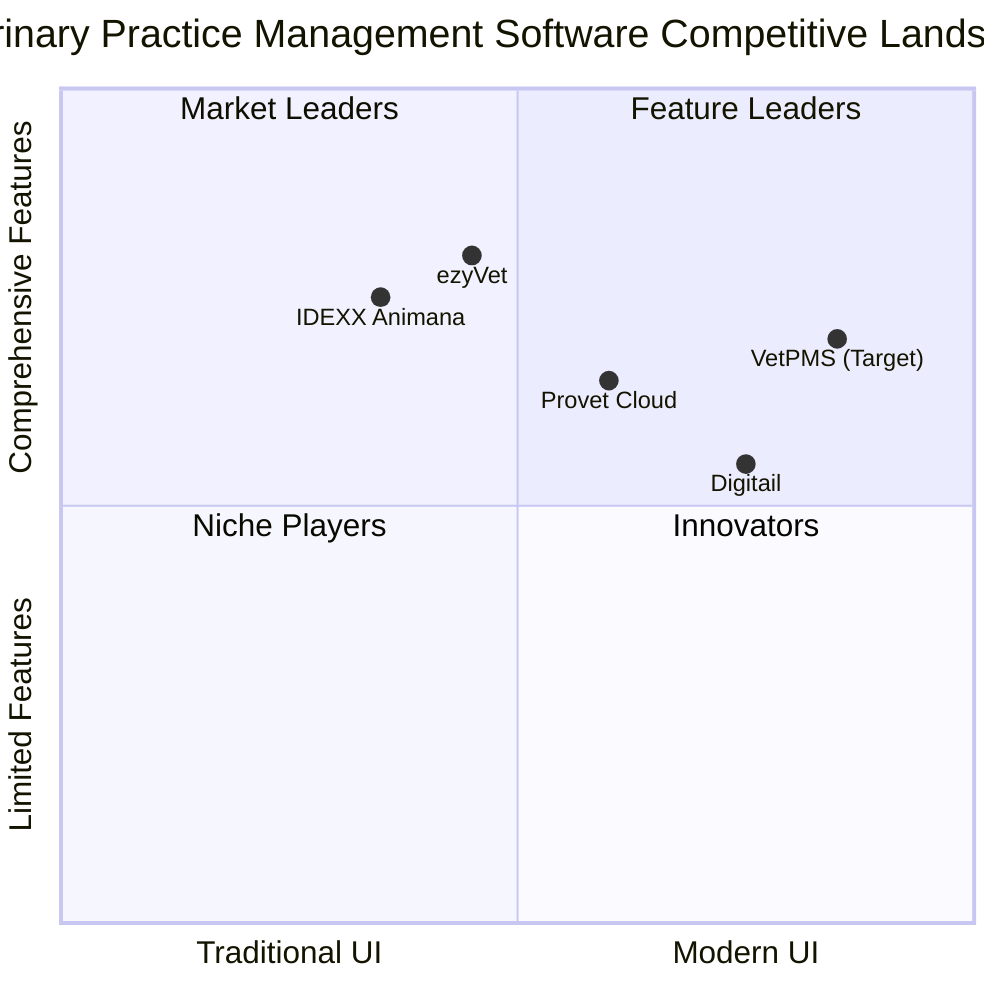

# VetPMS Strategic Roadmap & Market Analysis

## Executive Summary

The veterinary practice management software (VPMS) market is experiencing robust growth, valued at $1.85 billion in 2023 with projections to reach $3.21 billion by 2032 (CAGR 6.35%). VetPMS aims to disrupt this market by addressing key pain points in existing solutions through an innovative user interface, AI-powered features, and seamless integration capabilities.

This document outlines our strategic approach to product development, market positioning, and business growth based on comprehensive market research and competitive analysis.

## 1. Market Overview

### 1.1 Market Size and Growth

- **Current Value**: The veterinary practice management software segment is valued at approximately $375-404 million in 2024
- **Projected Growth**: 7-7.8% CAGR through 2031
- **Projected Value**: $550-680 million by 2031-2033
- **Regional Leadership**: North America dominates with 35.85% market share, followed by Europe
- **Fastest Growth**: Asia-Pacific region shows highest growth potential

### 1.2 Key Market Drivers

1. **Rising Pet Ownership**: Significant increases globally, accelerated by pandemic-related lifestyle changes
2. **Increased Animal Healthcare Spending**: Growing expenditure on preventive care and specialized treatments
3. **Practice Consolidation**: Emergence of corporate groups and franchises requiring multi-location management
4. **Technology Integration**: Demand for seamless connections between practice management, diagnostics, and telehealth
5. **Staff Shortages**: Veterinary practices face challenges recruiting qualified staff, making efficiency critical

### 1.3 Market Trends

1. **Cloud Adoption**: Cloud-based solutions dominate with 80.92% market share and growing
2. **AI Integration**: Growing at nearly 25% CAGR within veterinary software
3. **Mobile Focus**: Increasing demand for mobile-first or responsive solutions
4. **Telehealth Expansion**: Growing at 19.65% CAGR
5. **Integration Ecosystems**: Demand for platforms that connect with diagnostic equipment, pharmacies, and other systems

## 2. Competitive Landscape

### 2.1 Market Leaders

| Competitor | Strengths | Weaknesses | Market Position |
|------------|-----------|------------|-----------------|
| **IDEXX (Animana, ezyVet)** | Integrated laboratory services, comprehensive features | Expensive, complex UI, challenging learning curve | Market leader in Europe |
| **Covetrus (eVetPractice)** | Strong supply integration, wide adoption in NA | Less European presence, older interface | Strong in North America |
| **Provet Cloud** | Modern cloud platform, multi-location capabilities | Limited market penetration outside Nordics | Growing in European market |
| **Digitail** | Modern mobile-first approach, pet parent engagement | Limited history, developing feature depth | Emerging innovator |

### 2.2 Competitive Positioning

### 2.3 Key Differentiators

VetPMS will differentiate through:

1. **Context-Aware Interface**: Eliminating traditional navigation patterns in favor of role-optimized, contextual interfaces
2. **AI-Powered Efficiency**: Integrated AI for documentation, decision support, and workflow optimization
3. **Multi-Tenant Architecture**: Purpose-built for veterinary franchises and multi-location practices
4. **Seamless Integration**: Comprehensive connectivity with existing systems including Animana
5. **Mobile-First Design**: True mobile experience rather than responsive afterthought

## 3. Target Market

### 3.1 Primary Audience

1. **Veterinary Franchises**: Multi-location practices requiring centralized management and standardization
2. **Mid-to-Large Independent Practices**: Clinics with 3+ veterinarians seeking efficiency improvements
3. **Current Animana Users**: Practices frustrated with outdated interfaces but locked into the backend
4. **Tech-Forward Practices**: Early adopters embracing AI and digital transformation

### 3.2 User Personas

#### 3.2.1 Veterinarians

**Primary Needs**:
- Efficient medical record documentation
- Clinical decision support
- Quick patient history access
- Time-saving tools

**Pain Points**:
- Time-consuming documentation
- Inefficient workflows
- Limited integration with diagnostic tools

#### 3.2.2 Practice Managers

**Primary Needs**:
- Business performance analytics
- Staff scheduling and management
- Multi-location oversight
- Financial reporting

**Pain Points**:
- Limited customizable reports
- Inadequate multi-location management
- Poor inventory control features

#### 3.2.3 Receptionists

**Primary Needs**:
- Efficient appointment scheduling
- Client communication management
- Invoicing and payment processing

**Pain Points**:
- Complex scheduling interfaces
- Inefficient client check-in/check-out
- Limited client communication tools

#### 3.2.4 Corporate Leadership

**Primary Needs**:
- Multi-location standardization
- Comparative performance analytics
- Enterprise-level reporting

**Pain Points**:
- Inconsistent data across locations
- Limited multi-tenant architecture
- Poor enterprise reporting

## 4. Product Strategy

### 4.1 Vision and Mission

**Vision**: To revolutionize veterinary practice management through intuitive, intelligent software that adapts to how veterinary teams actually work.

**Mission**: To save veterinary professionals time, reduce administrative burden, and improve clinical outcomes through contextual design and AI assistance.

### 4.2 Core Value Propositions

1. **Time Savings**: Reduce documentation time by 50% with AI assistance
2. **Contextual Experience**: Interface that adapts to user role, location, and activities
3. **Multi-Tenant Efficiency**: Centralized knowledge with local flexibility for practice groups
4. **Integration Ecosystem**: Seamless connectivity with preferred tools and services
5. **Business Intelligence**: Advanced analytics for operational optimization

### 4.3 Major Feature Areas

| Feature Area | MVP | Phase 2 | Phase 3 | Phase 4 |
|--------------|-----|---------|---------|---------|
| **Context-Aware UI** | Basic role views | Personalization | Workflow learning | Voice UI |
| **AI Assistance** | - | Basic SOAP help | Clinical decision support | Predictive care |
| **Multi-Tenancy** | Single practice | Basic multi-location | Franchise features | Global enterprise |
| **Client Experience** | Basic portal | Self-scheduling | Telemedicine | Health monitoring |
| **Interoperability** | Animana connector | Lab integrations | Ecosystem API | Marketplace |

## 5. Development Roadmap

### 5.1 Phase 1: MVP (Months 1-4)

**Goal**: Deliver core functionality for first paying customer

**Key Deliverables**:
- Basic authentication system
- Client/patient management
- Simple appointment scheduling
- Basic medical records (SOAP)
- Manual billing
- Animana backend integration

**Success Metrics**:
- 1 paying customer
- <3 second page load time
- <5 critical bugs
- 80% feature completion
- Positive user feedback

### 5.2 Phase 2: Enhanced Features (Months 5-8)

**Goal**: Add key features based on initial feedback

**Key Deliverables**:
- Enhanced scheduling
- Advanced medical records
- Client communication tools
- Basic reporting
- UI/UX refinements
- Bug fixes and optimizations

**Success Metrics**:
- 10 active practices
- 95% system uptime
- <2 second response time
- 90% user satisfaction
- Break-even on operational costs

### 5.3 Phase 3: Multi-Practice & Integration (Months 9-12)

**Goal**: Enable multi-location support and integrations

**Key Deliverables**:
- Multi-tenant architecture
- Cross-practice reporting
- Integration framework
- Advanced roles and permissions
- API for third-party developers
- Own backend option (parallel to Animana)

**Success Metrics**:
- 50+ practices
- 2+ enterprise customers
- 99.9% uptime
- <1 second response time
- Profitable operations

### 5.4 Phase 4: AI & Innovation (Months 13-18)

**Goal**: Introduce advanced AI capabilities

**Key Deliverables**:
- AI documentation assistant
- Diagnostic suggestions
- Treatment recommendations
- Automated client communications
- Predictive analytics
- Advanced mobile experience

**Success Metrics**:
- 200+ practices
- International presence
- Market leadership in innovation
- 99.99% uptime
- Sustainable growth model

## 6. Resource Planning

### 6.1 Team Growth

**MVP (Months 1-4)**
- 1 Full-stack Developer (Founder)
- 1 Part-time UI/UX Designer
- 1 Part-time QA

**Phase 2 (Months 5-8)**
- +1 Full-stack Developer
- +1 DevOps Engineer (part-time)
- QA to full-time

**Phase 3 (Months 9-12)**
- +2 Backend Developers
- +1 Frontend Developer
- +1 Product Manager
- DevOps to full-time

**Phase 4 (Months 13-18)**
- +2 AI/ML Engineers
- +1 Mobile Developer
- +1 Security Specialist
- +2 Customer Success

### 6.2 Budget Requirements

**Development Costs (Year 1)**
- Infrastructure: €15,000
- Third-party services: €10,000
- Development tools & licenses: €5,000
- Contract work: €30,000
- **Total**: €60,000

**Operational Costs (Monthly after launch)**
- Cloud hosting: €2,000
- Third-party APIs: €1,000
- Support tools: €500
- **Total**: €3,500/month

## 7. Go-to-Market Strategy

### 7.1 Pricing Model

**Subscription Tiers**:
- **Essential**: €X/month - Basic features for small practices
- **Professional**: €Y/month - Advanced features for growing practices
- **Enterprise**: Custom pricing - Multi-location management and dedicated support

**Additional Revenue Streams**:
- Implementation services
- Training and certification
- Integration development
- Premium support
- Advisory services

### 7.2 Launch Strategy

**Phase 1: Soft Launch**
- Direct sales to 1-3 pilot clinics
- White-glove onboarding and training
- Rapid iteration based on feedback
- Build case studies and testimonials

**Phase 2: Limited Release**
- Target specific segment (e.g., Animana users in Netherlands)
- Local veterinary association partnerships
- Google Ads for "Animana alternative"
- Case studies from pilot clinics

**Phase 3: Full Market Entry**
- Veterinary conferences and events
- Partnership with suppliers and labs
- Franchise group targeting
- Content marketing strategy
- Referral program

### 7.3 Sales Channels

1. **Direct Sales**: For enterprise and franchise clients
2. **Inside Sales**: For mid-sized practices
3. **Partner Channel**: Through practice consultants and equipment vendors
4. **Website**: Self-service for smaller practices

### 7.4 Marketing Strategy

**Content Marketing**: Educational content on practice efficiency and digital transformation
**Social Proof**: Case studies and testimonials from successful implementations
**Industry Events**: Presence at key veterinary conferences
**Digital Marketing**: Targeted campaigns for specific segments
**Partnership Marketing**: Co-marketing with integrated solution providers

## 8. Risk Assessment

### 8.1 Market Risks

| Risk | Impact | Probability | Mitigation |
|------|--------|------------|------------|
| Slow adoption | High | Medium | Focus on pilot customers, iterate quickly |
| Competitor response | Medium | High | Rapid innovation, build strong relationships |
| Market consolidation | Medium | Medium | Target growing franchise segment |
| Regulatory changes | Medium | Low | Maintain compliance expertise |

### 8.2 Technical Risks

| Risk | Impact | Probability | Mitigation |
|------|--------|------------|------------|
| Animana API limitations | High | Medium | Build abstraction layer, alternative backend |
| Scale challenges | Medium | Low | Cloud-native architecture, performance testing |
| Security breaches | High | Low | Regular security audits, GDPR compliance |
| AI reliability | Medium | Medium | Thorough testing, human oversight options |

### 8.3 Business Risks

| Risk | Impact | Probability | Mitigation |
|------|--------|------------|------------|
| Cash flow constraints | High | Medium | Lean development, prioritize revenue features |
| Team scalability | Medium | Medium | Strong hiring pipeline, documentation |
| Support overhead | Medium | High | Self-service tools, knowledge base |
| Feature creep | Medium | High | Strict MVP scope management |

## 9. Success Metrics and KPIs

### 9.1 Business Metrics

- Monthly Recurring Revenue (MRR)
- Customer Acquisition Cost (CAC)
- Customer Lifetime Value (LTV)
- Churn Rate
- Expansion Revenue
- Net Promoter Score (NPS)

### 9.2 Product Metrics

- Daily/Weekly Active Users (DAU/WAU)
- Feature Adoption Rates
- Time Spent in Application
- Task Completion Time
- Error Rates
- Support Ticket Volume

### 9.3 Technical Metrics

- System Uptime
- Response Time
- Error Rates
- Infrastructure Cost per User
- Security Incidents
- Integration Reliability

## 10. Conclusion

VetPMS addresses significant pain points in the veterinary practice management market through innovative design, AI-powered features, and multi-tenant architecture. Our phased approach balances rapid time-to-market with sustainable growth, while our go-to-market strategy focuses on building credibility through successful implementations.

By prioritizing user experience and time-saving features, VetPMS will deliver measurable ROI to veterinary practices while building a sustainable, profitable business. The growing market and clear competitive gaps create an excellent opportunity for disruption, particularly in the underserved franchise segment.

## Appendices

### A. Detailed Market Research Methodology

- Survey of 150+ veterinary professionals
- Competitive product analysis
- User interview findings
- Industry expert consultations

### B. Competitive Feature Comparison

Detailed feature-by-feature comparison of VetPMS vs. key competitors.

### C. Financial Projections

Three-year financial model with multiple growth scenarios.

### D. Technical Architecture Overview

High-level overview of system architecture and technology choices.
