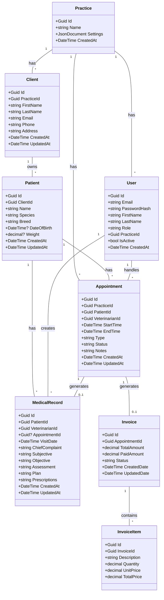
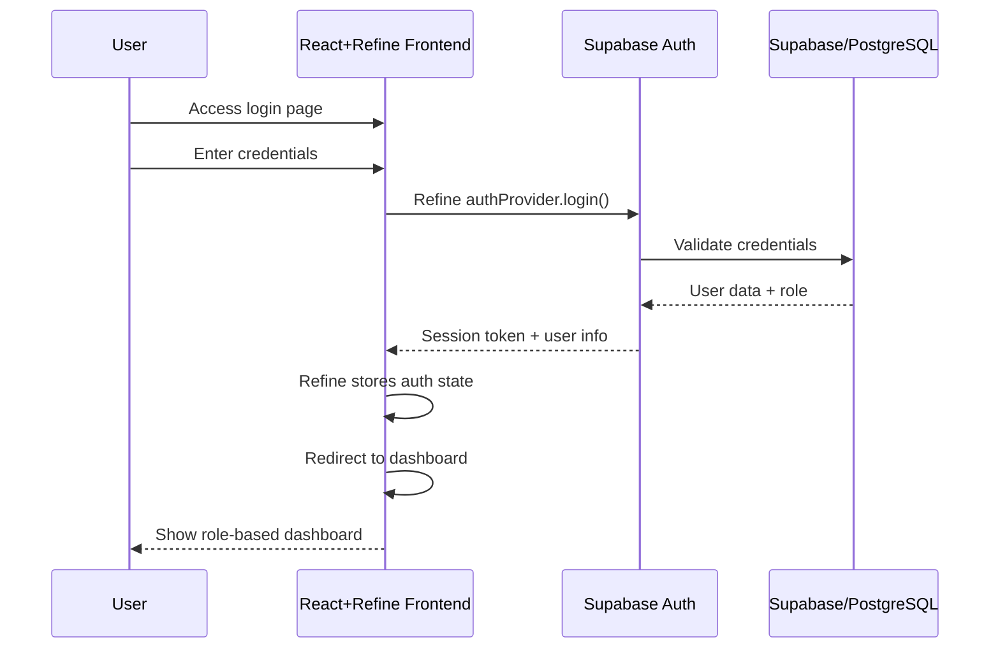
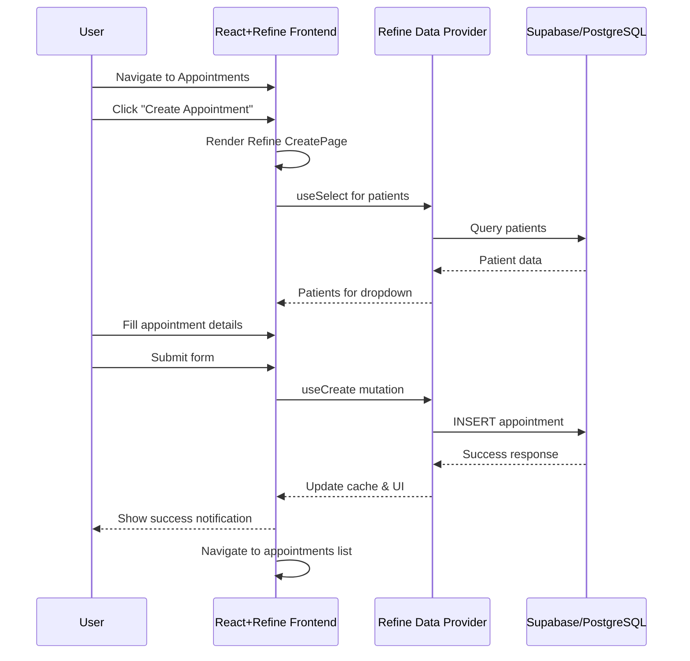
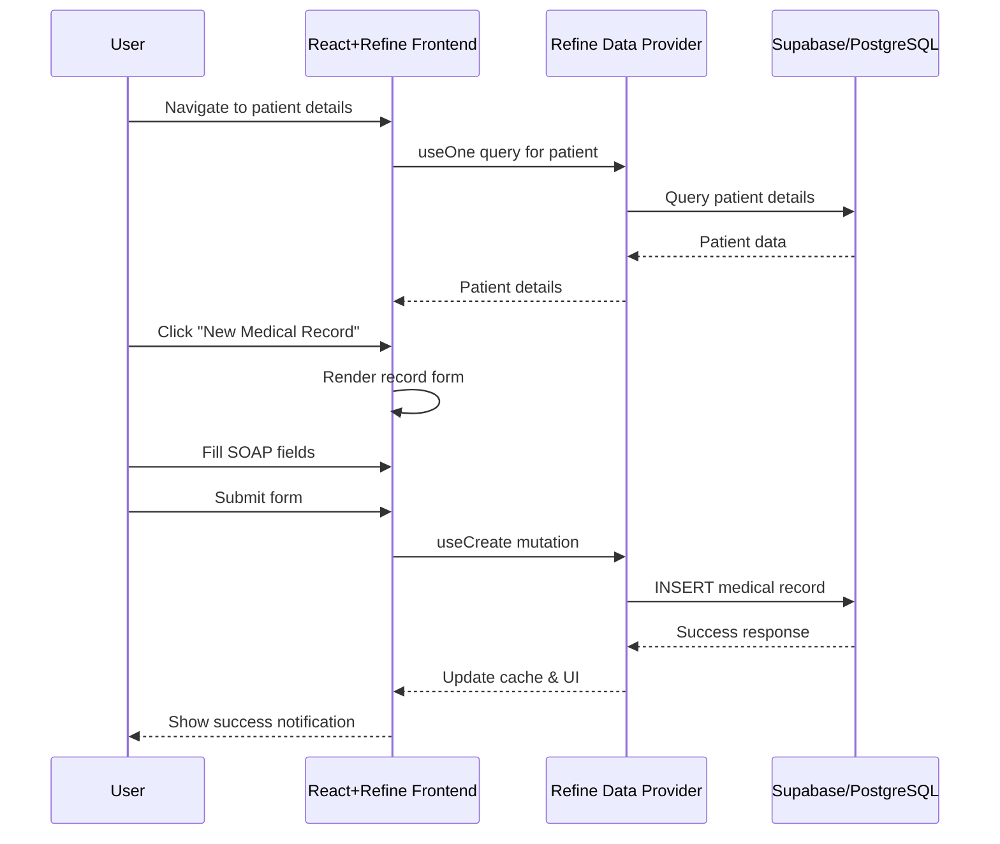
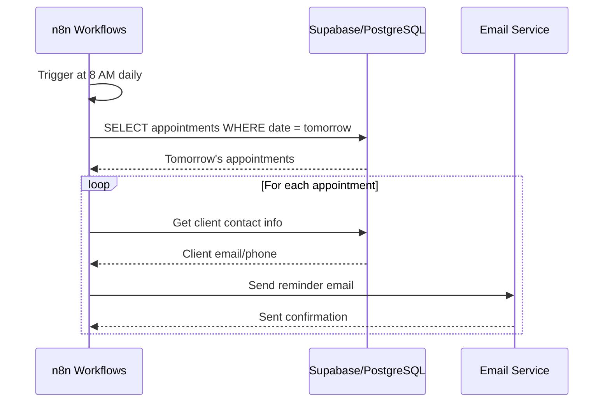

# VetPMS MVP Implementation Guide

## Table of Contents

1. [Introduction](#introduction)
2. [Implementation Overview](#implementation-overview)
3. [Refine.dev Integration](#refinedev-integration)
4. [Domain Model](#domain-model)
5. [Interaction Flows](#interaction-flows)
6. [UI Component Library](#ui-component-library)
7. [Development Setup](#development-setup)
8. [API Implementation](#api-implementation)
9. [Testing Strategy](#testing-strategy)
10. [Known Limitations](#known-limitations)
11. [Next Steps](#next-steps)

## Introduction

This document serves as a comprehensive guide for implementing the VetPMS MVP (Minimum Viable Product). It combines the essential technical details, domain model, interaction flows, and development practices required to build the foundation of the veterinary practice management system quickly and efficiently.

The MVP focuses on delivering core functionality with a simplified architecture, allowing for rapid development and validation with early customers. **To accelerate development and time-to-market, we've made the strategic decision to integrate Refine.dev as our frontend data layer framework**, which will provide immediate benefits in terms of development speed and built-in functionality.

## Implementation Overview

### Project Status

- **Phase**: MVP Development
- **Target Completion**: 4 months (accelerated with Refine.dev)
- **Architecture**: Monolithic ASP.NET Core API with React frontend using Refine.dev
- **Focus**: Essential features only

### Technology Stack

**Frontend:**
- React 18 with TypeScript
- **Refine.dev** for data layer, CRUD operations, authentication, and routing
- Tailwind CSS for styling
- Shadcn/ui components
- React Query (integrated with Refine.dev)
- React Router (integrated with Refine.dev)

**Backend:**
- ASP.NET Core 8 (monolithic architecture)
- Entity Framework Core with PostgreSQL
- Simple JWT authentication
- Basic repository pattern

**Temporary Backend (Initial Development):**
- Supabase as temporary backend
- PostgreSQL database (managed by Supabase)
- Supabase Auth
- Supabase Row-Level Security

**Infrastructure:**
- Azure App Service for hosting
- Azure Database for PostgreSQL (or Supabase during initial development)
- n8n for workflow automation
- SendGrid for emails

### Project Structure

```
vetpms/
├── frontend/
│   ├── src/
│   │   ├── components/     # UI components
│   │   ├── pages/          # Page components
│   │   ├── services/       # API services
│   │   ├── hooks/          # Custom hooks
│   │   ├── providers/      # Refine.dev providers
│   │   ├── types/          # TypeScript types
│   │   └── App.tsx         # Root component with Refine.dev setup
│   └── package.json
│
├── backend/
│   ├── VetPMS.API/         # API project
│   ├── VetPMS.Core/        # Domain models
│   ├── VetPMS.Data/        # Data access
│   └── VetPMS.sln
│
└── docker-compose.yml      # Local development
```

### MVP Features

The MVP implementation includes:

1. **Basic Authentication**
   - Simple email/password login
   - JWT token generation
   - Role-based access (Admin, Veterinarian, Receptionist)

2. **Client & Patient Management**
   - Create/edit clients
   - Add patients to clients
   - View patient history
   - Basic search functionality

3. **Appointment Scheduling**
   - Create appointments
   - View daily/weekly schedule
   - Basic status management

4. **Medical Records**
   - Create SOAP notes
   - View medical history
   - Basic documentation

5. **Simple Billing**
   - Create invoices
   - Mark as paid
   - Basic financial tracking

6. **Automated Workflows**
   - Basic appointment reminders via n8n
   - Simple email notifications

## Refine.dev Integration

### Overview of Refine.dev

Refine.dev is a React-based framework for building data-intensive applications. By adopting Refine.dev for our frontend development, we gain:

1. **Rapid CRUD Operations**: Built-in data fetching and form handling
2. **Authentication**: Pre-built auth provider patterns
3. **Routing**: Integrated routing system
4. **State Management**: React Query integration for efficient data handling
5. **Backend Integration**: Official adapters for various backends, including Supabase

### Implementation Approach

We're implementing a phased approach using Refine.dev:

#### Phase 1: Supabase Temporary Backend
- Set up Supabase as our temporary backend
- Use Refine.dev's Supabase adapter
- Implement core CRUD operations with minimal custom code

#### Phase 2: Migration to Final Backend
- Develop our ASP.NET Core backend in parallel
- Create a custom Refine.dev data provider for our .NET API
- Gradually transition from Supabase to our custom backend

### Refine.dev App Setup

```typescript
// App.tsx - Main Refine.dev setup
import { Refine } from "@refinedev/core";
import { RefineKbar, RefineKbarProvider } from "@refinedev/kbar";
import routerBindings, { NavigateToResource } from "@refinedev/react-router-v6";
import { BrowserRouter, Route, Routes } from "react-router-dom";

// Import our custom components
import { AppLayout } from "./components/layout/AppLayout";
import { Dashboard } from "./pages/Dashboard";
import { ClientList, ClientCreate, ClientEdit, ClientShow } from "./pages/clients";
import { PatientList, PatientCreate, PatientEdit, PatientShow } from "./pages/patients";

// Import data provider (Supabase for MVP Phase 1)
import { dataProvider } from "@refinedev/supabase";
import { supabaseClient } from "./utility/supabaseClient";

// Import auth provider
import { authProvider } from "./providers/authProvider";

function App() {
  return (
    <BrowserRouter>
      <RefineKbarProvider>
        <Refine
          dataProvider={dataProvider(supabaseClient)}
          authProvider={authProvider}
          routerProvider={routerBindings}
          resources={[
            {
              name: "dashboard",
              list: "/dashboard",
            },
            {
              name: "clients",
              list: "/clients",
              show: "/clients/:id",
              create: "/clients/create",
              edit: "/clients/:id/edit",
            },
            {
              name: "patients",
              list: "/patients",
              show: "/patients/:id",
              create: "/patients/create",
              edit: "/patients/:id/edit",
            },
            // Additional resources
          ]}
          options={{
            syncWithLocation: true,
            warnWhenUnsavedChanges: true,
          }}
        >
          <Routes>
            <Route element={<AppLayout />}>
              <Route path="/dashboard" element={<Dashboard />} />
              <Route path="/clients" element={<ClientList />} />
              <Route path="/clients/create" element={<ClientCreate />} />
              <Route path="/clients/:id" element={<ClientShow />} />
              <Route path="/clients/:id/edit" element={<ClientEdit />} />
              <Route path="/patients" element={<PatientList />} />
              <Route path="/patients/create" element={<PatientCreate />} />
              <Route path="/patients/:id" element={<PatientShow />} />
              <Route path="/patients/:id/edit" element={<PatientEdit />} />
              {/* Additional routes */}
            </Route>
          </Routes>
        </Refine>
      </RefineKbarProvider>
    </BrowserRouter>
  );
}
```

### Refine.dev Auth Provider

```typescript
// authProvider.ts - Authentication provider for Refine.dev
import { AuthProvider } from "@refinedev/core";
import { supabaseClient } from "../utility/supabaseClient";

export const authProvider: AuthProvider = {
  login: async ({ email, password }) => {
    const { data, error } = await supabaseClient.auth.signInWithPassword({
      email,
      password,
    });

    if (error) {
      return {
        success: false,
        error,
      };
    }

    if (data?.user) {
      return {
        success: true,
        redirectTo: "/dashboard",
      };
    }

    return {
      success: false,
      error: {
        message: "Login failed",
        name: "Invalid email or password",
      },
    };
  },
  
  logout: async () => {
    const { error } = await supabaseClient.auth.signOut();

    if (error) {
      return {
        success: false,
        error,
      };
    }

    return {
      success: true,
      redirectTo: "/login",
    };
  },
  
  // Additional auth provider methods
  checkError: () => Promise.resolve(),
  checkAuth: async () => {
    const { data } = await supabaseClient.auth.getSession();
    
    if (data.session) {
      return Promise.resolve();
    }

    return Promise.reject();
  },
  getPermissions: async () => {
    const { data } = await supabaseClient.auth.getUser();
    
    if (data.user) {
      return Promise.resolve(data.user.role);
    }
    
    return Promise.reject();
  },
  getUserIdentity: async () => {
    const { data } = await supabaseClient.auth.getUser();
    
    if (data.user) {
      return Promise.resolve({
        ...data.user,
        name: data.user.email,
      });
    }
    
    return Promise.reject();
  },
};
```

## Domain Model

The MVP domain model is intentionally simplified compared to the full system, focusing only on essential entities and relationships.



### Key Differences from Full System

The MVP class diagram simplifies the architecture by:

1. **Removing Multi-tenant Hierarchy**: No franchise/department structure, just single practice
2. **Simplifying User Management**: Single role per user instead of complex role-permission system
3. **Basic Medical Records**: Text-based prescriptions instead of complex prescription management
4. **Simplified Appointments**: No resource management or complex scheduling
5. **No Integration Framework**: Direct database operations instead of integration hub
6. **Basic Billing**: Simple invoice structure without complex payment processing

### Supabase Schema for Temporary Backend

For our temporary Supabase backend, we'll implement this model as PostgreSQL tables with the following schema:

```sql
-- Users table
CREATE TABLE users (
  id UUID PRIMARY KEY DEFAULT uuid_generate_v4(),
  email TEXT UNIQUE NOT NULL,
  first_name TEXT NOT NULL,
  last_name TEXT NOT NULL,
  role TEXT NOT NULL,
  practice_id UUID NOT NULL,
  is_active BOOLEAN DEFAULT true,
  created_at TIMESTAMP WITH TIME ZONE DEFAULT NOW()
);

-- Practices table
CREATE TABLE practices (
  id UUID PRIMARY KEY DEFAULT uuid_generate_v4(),
  name TEXT NOT NULL,
  settings JSONB DEFAULT '{}',
  created_at TIMESTAMP WITH TIME ZONE DEFAULT NOW()
);

-- Clients table
CREATE TABLE clients (
  id UUID PRIMARY KEY DEFAULT uuid_generate_v4(),
  practice_id UUID NOT NULL REFERENCES practices(id),
  first_name TEXT NOT NULL,
  last_name TEXT NOT NULL,
  email TEXT,
  phone TEXT,
  address TEXT,
  created_at TIMESTAMP WITH TIME ZONE DEFAULT NOW(),
  updated_at TIMESTAMP WITH TIME ZONE DEFAULT NOW()
);

-- Patients table
CREATE TABLE patients (
  id UUID PRIMARY KEY DEFAULT uuid_generate_v4(),
  client_id UUID NOT NULL REFERENCES clients(id),
  name TEXT NOT NULL,
  species TEXT NOT NULL,
  breed TEXT,
  date_of_birth DATE,
  weight DECIMAL,
  created_at TIMESTAMP WITH TIME ZONE DEFAULT NOW(),
  updated_at TIMESTAMP WITH TIME ZONE DEFAULT NOW()
);

-- Additional tables for appointments, medical records, invoices, etc.
```

## Interaction Flows

### Authentication Flow with Refine.dev



### Appointment Creation Flow with Refine.dev



### Medical Record Creation Flow with Refine.dev



### Automated Reminder Flow with n8n



## UI Component Library

Our UI component library incorporates Refine.dev components and hooks alongside our custom components, providing a rapid development approach with consistent styling.

### Layout Components

#### AppLayout with Refine.dev

```typescript
import { LayoutProps } from "@refinedev/core";
import { Outlet } from "react-router-dom";
import { Header } from "./Header";
import { Sidebar } from "./Sidebar";

export const AppLayout: React.FC<LayoutProps> = ({ children }) => {
  return (
    <div className="flex h-screen bg-gray-100">
      <Sidebar />
      <div className="flex-1 flex flex-col overflow-hidden">
        <Header />
        <main className="flex-1 overflow-y-auto p-6">
          {children ?? <Outlet />}
        </main>
      </div>
    </div>
  );
};
```

### List Components with Refine.dev

```typescript
import { useTable } from "@refinedev/react-table";
import { ColumnDef } from "@tanstack/react-table";
import { formatDate } from "@/lib/utils";

export const PatientList: React.FC = () => {
  // Define columns
  const columns = React.useMemo<ColumnDef<any>[]>(
    () => [
      {
        id: "name",
        header: "Name",
        accessorKey: "name",
      },
      {
        id: "species",
        header: "Species",
        accessorKey: "species",
      },
      {
        id: "breed",
        header: "Breed",
        accessorKey: "breed",
      },
      {
        id: "dateOfBirth",
        header: "Date of Birth",
        accessorKey: "dateOfBirth",
        cell: ({ getValue }) => formatDate(getValue() as string),
      },
      {
        id: "actions",
        header: "Actions",
        accessorKey: "id",
        cell: ({ getValue }) => (
          <div className="flex gap-2">
            <Button
              variant="outline"
              size="sm"
              onClick={() => {
                show("patients", getValue() as string);
              }}
            >
              View
            </Button>
            <Button
              variant="outline"
              size="sm"
              onClick={() => {
                edit("patients", getValue() as string);
              }}
            >
              Edit
            </Button>
          </div>
        ),
      },
    ],
    []
  );

  // Use Refine's useTable hook
  const {
    getHeaderGroups,
    getRowModel,
    refineCore: { tableQueryResult },
  } = useTable({
    columns,
    refineCoreProps: {
      resource: "patients",
    },
  });

  const isLoading = tableQueryResult?.isLoading || tableQueryResult?.isFetching;
  const patients = tableQueryResult?.data?.data || [];

  return (
    <div>
      <PageHeader 
        title="Patients" 
        action={
          <Button
            onClick={() => {
              create("patients");
            }}
          >
            Create Patient
          </Button>
        } 
      />
      
      {isLoading ? (
        <div className="space-y-4">
          {[...Array(5)].map((_, i) => (
            <Skeleton key={i} className="h-16 w-full rounded-lg" />
          ))}
        </div>
      ) : (
        <div className="bg-white shadow rounded-lg overflow-hidden">
          <table className="min-w-full divide-y divide-gray-200">
            <thead className="bg-gray-50">
              {getHeaderGroups().map((headerGroup) => (
                <tr key={headerGroup.id}>
                  {headerGroup.headers.map((header) => (
                    <th
                      key={header.id}
                      className="px-6 py-3 text-left text-xs font-medium text-gray-500 uppercase tracking-wider"
                    >
                      {header.isPlaceholder
                        ? null
                        : flexRender(
                            header.column.columnDef.header,
                            header.getContext()
                          )}
                    </th>
                  ))}
                </tr>
              ))}
            </thead>
            <tbody className="bg-white divide-y divide-gray-200">
              {getRowModel().rows.map((row) => (
                <tr key={row.id}>
                  {row.getVisibleCells().map((cell) => (
                    <td
                      key={cell.id}
                      className="px-6 py-4 whitespace-nowrap"
                    >
                      {flexRender(
                        cell.column.columnDef.cell,
                        cell.getContext()
                      )}
                    </td>
                  ))}
                </tr>
              ))}
            </tbody>
          </table>
        </div>
      )}
    </div>
  );
};
```

### Form Components with Refine.dev

```typescript
import { useForm } from "@refinedev/react-hook-form";
import { Form, FormControl, FormField, FormItem, FormLabel, FormMessage } from "@/components/ui/form";
import { Input } from "@/components/ui/input";
import { Button } from "@/components/ui/button";
import { Card, CardContent, CardHeader, CardTitle } from "@/components/ui/card";
import { Textarea } from "@/components/ui/textarea";

export const MedicalRecordCreate: React.FC = () => {
  // Use Refine's form hook
  const {
    refineCore: { formLoading, onFinish },
    register,
    handleSubmit,
    formState: { errors },
  } = useForm({
    refineCoreProps: {
      resource: "medical-records",
      action: "create",
      redirect: "show",
    },
  });

  return (
    <div>
      <PageHeader title="Create Medical Record" />
      
      <form onSubmit={handleSubmit(onFinish)}>
        <Card>
          <CardHeader>
            <CardTitle>SOAP Note</CardTitle>
          </CardHeader>
          <CardContent className="space-y-4">
            <FormField
              control={control}
              name="chiefComplaint"
              render={({ field }) => (
                <FormItem>
                  <FormLabel>Chief Complaint</FormLabel>
                  <FormControl>
                    <Input {...field} />
                  </FormControl>
                  <FormMessage />
                </FormItem>
              )}
            />
            
            <FormField
              control={control}
              name="subjective"
              render={({ field }) => (
                <FormItem>
                  <FormLabel>Subjective</FormLabel>
                  <FormControl>
                    <Textarea {...field} rows={3} />
                  </FormControl>
                  <FormMessage />
                </FormItem>
              )}
            />
            
            {/* Other SOAP form fields */}
          </CardContent>
        </Card>
        
        <div className="mt-4 flex justify-end gap-2">
          <Button
            type="button"
            variant="outline"
            onClick={() => {
              redirect("list", "medical-records");
            }}
          >
            Cancel
          </Button>
          <Button
            type="submit"
            disabled={formLoading}
          >
            {formLoading ? "Saving..." : "Save"}
          </Button>
        </div>
      </form>
    </div>
  );
};
```

### Custom Hooks with Refine.dev

Refine.dev provides most of the data hooks we need, but we can create custom hooks when necessary:

```typescript
import { useOne, useList } from "@refinedev/core";

// Custom hook for patient medical history
export const usePatientMedicalHistory = (patientId: string) => {
  return useList({
    resource: "medical-records",
    filters: [
      {
        field: "patientId",
        operator: "eq",
        value: patientId,
      },
    ],
    sorters: [
      {
        field: "visitDate",
        order: "desc",
      },
    ],
  });
};

// Custom hook for upcoming appointments
export const useUpcomingAppointments = () => {
  const today = new Date().toISOString().split("T")[0];
  
  return useList({
    resource: "appointments",
    filters: [
      {
        field: "startTime",
        operator: "gte",
        value: today,
      },
    ],
    sorters: [
      {
        field: "startTime",
        order: "asc",
      },
    ],
    pagination: {
      pageSize: 10,
    },
  });
};
```

## Development Setup

### Prerequisites
- Node.js 18+
- .NET 8 SDK
- PostgreSQL 14+ (for final backend)
- Supabase account (for temporary backend)
- Docker Desktop

### Frontend Setup with Refine.dev
```bash
# Create a new Refine.dev project
npm create refine-app@latest vetpms-frontend

# Select options:
# - UI Framework: Tailwind CSS
# - Data Provider: Supabase
# - Auth Provider: Supabase
# - Router Provider: React Router v6

# Install additional dependencies
cd vetpms-frontend
npm install @tanstack/react-table @refinedev/react-table
npm install @radix-ui/react-dialog @radix-ui/react-toast
npm install date-fns react-datepicker
```

### Supabase Setup
1. Create a new Supabase project
2. Create tables according to schema
3. Set up row-level security policies
4. Configure authentication

### Supabase Client Configuration
```typescript
// utility/supabaseClient.ts
import { createClient } from "@supabase/supabase-js";

const supabaseUrl = import.meta.env.VITE_SUPABASE_URL;
const supabaseKey = import.meta.env.VITE_SUPABASE_ANON_KEY;

export const supabaseClient = createClient(supabaseUrl, supabaseKey);
```

### Backend Setup
```bash
cd backend
dotnet restore
dotnet run --project VetPMS.API
```

### n8n Setup
```bash
docker run -d \
  --name n8n \
  -p 5678:5678 \
  -v n8n_data:/home/node/.n8n \
  n8nio/n8n
```

### Environment Variables

**Frontend (.env)**
```
VITE_SUPABASE_URL=https://your-project.supabase.co
VITE_SUPABASE_ANON_KEY=your-anon-key
VITE_API_URL=http://localhost:5000/api/v1
VITE_APP_NAME=VetPMS
```

**Backend (appsettings.json)**
```json
{
  "ConnectionStrings": {
    "DefaultConnection": "Host=localhost;Database=vetpms;Username=postgres;Password=postgres"
  },
  "Jwt": {
    "Key": "your-256-bit-secret",
    "Issuer": "VetPMS",
    "Audience": "VetPMS"
  },
  "SendGrid": {
    "ApiKey": "your-sendgrid-key"
  }
}
```

## API Implementation

### Authentication Endpoints

```http
POST /api/v1/auth/login
Content-Type: application/json

{
  "email": "string",
  "password": "string"
}
```

**Response**
```json
{
  "token": "string",
  "user": {
    "id": "uuid",
    "email": "string",
    "role": "string",
    "firstName": "string",
    "lastName": "string"
  }
}
```

### Client Endpoints

```http
GET /api/v1/clients
```

**Query Parameters**
- `search`: Search by name or email
- `page`: Page number (default: 1)
- `limit`: Items per page (default: 20)

```http
POST /api/v1/clients
Content-Type: application/json

{
  "firstName": "string",
  "lastName": "string",
  "email": "string",
  "phone": "string",
  "address": "string"
}
```

### Patient Endpoints

```http
GET /api/v1/patients
```

**Query Parameters**
- `clientId`: Filter by client
- `search`: Search by name
- `page`: Page number
- `limit`: Items per page

```http
POST /api/v1/patients
Content-Type: application/json

{
  "name": "string",
  "species": "string",
  "breed": "string",
  "dateOfBirth": "date",
  "weight": "number",
  "clientId": "uuid"
}
```

### Appointment Endpoints

```http
GET /api/v1/appointments
```

**Query Parameters**
- `startDate`: Filter by start date
- `endDate`: Filter by end date
- `veterinarianId`: Filter by veterinarian
- `status`: Filter by status

```http
POST /api/v1/appointments
Content-Type: application/json

{
  "patientId": "uuid",
  "veterinarianId": "uuid",
  "startTime": "datetime",
  "endTime": "datetime",
  "type": "string",
  "notes": "string"
}
```

### Medical Record Endpoints

```http
GET /api/v1/medical-records
```

**Query Parameters**
- `patientId`: Filter by patient
- `startDate`: Filter by start date
- `endDate`: Filter by end date

```http
POST /api/v1/medical-records
Content-Type: application/json

{
  "patientId": "uuid",
  "visitDate": "datetime",
  "chiefComplaint": "string",
  "subjective": "string",
  "objective": "string",
  "assessment": "string",
  "plan": "string",
  "prescriptions": "string"
}
```

### Invoice Endpoints

```http
GET /api/v1/invoices
```

**Query Parameters**
- `startDate`: Filter by start date
- `endDate`: Filter by end date
- `status`: Filter by status

```http
POST /api/v1/invoices
Content-Type: application/json

{
  "appointmentId": "uuid",
  "items": [
    {
      "description": "string",
      "quantity": "number",
      "unitPrice": "number"
    }
  ]
}
```

## Testing Strategy

### Testing Setup

The project uses Vitest as the testing framework with the following configuration:

```json
// vitest.config.ts
import { defineConfig } from "vitest/config";
import react from "@vitejs/plugin-react";

export default defineConfig({
  plugins: [react()],
  test: {
    environment: "jsdom",
    globals: true,
    setupFiles: "./src/test/setup.ts",
  },
});
```

### Testing with Refine.dev

When testing components that use Refine.dev hooks and components, we need to provide the necessary Refine providers:

```typescript
// test/TestWrapper.tsx
import { PropsWithChildren } from "react";
import { Refine } from "@refinedev/core";
import { MemoryRouter, Routes, Route } from "react-router-dom";
import { render, RenderOptions } from "@testing-library/react";
import { MockAuthProvider } from "./mockAuthProvider";
import { mockDataProvider } from "./mockDataProvider";

type TestWrapperProps = {
  routerInitialEntries?: string[];
} & PropsWithChildren;

const TestWrapper: React.FC<TestWrapperProps> = ({
  children,
  routerInitialEntries = ["/"],
}) => {
  return (
    <MemoryRouter initialEntries={routerInitialEntries}>
      <MockAuthProvider>
        <Refine
          dataProvider={mockDataProvider}
          routerProvider={{
            useLocation: () => {
              return new URL(routerInitialEntries[0], "http://localhost") as any;
            },
          }}
          resources={[
            {
              name: "patients",
              list: "/patients",
              show: "/patients/:id",
              create: "/patients/create",
              edit: "/patients/:id/edit",
            },
            // Other resources
          ]}
        >
          <Routes>
            <Route path="*" element={children} />
          </Routes>
        </Refine>
      </MockAuthProvider>
    </MemoryRouter>
  );
};

// Custom render with the wrapper
function renderWithProviders(
  ui: React.ReactElement,
  options?: Omit<RenderOptions, "wrapper"> & {
    routerInitialEntries?: string[];
  }
) {
  const { routerInitialEntries, ...renderOptions } = options || {};
  
  return render(ui, {
    wrapper: ({ children }) => (
      <TestWrapper routerInitialEntries={routerInitialEntries}>
        {children}
      </TestWrapper>
    ),
    ...renderOptions,
  });
}

export { renderWithProviders };
```

### Test Examples

#### Component Tests

```typescript
import { renderWithProviders } from "@/test/TestWrapper";
import { screen, waitFor } from "@testing-library/react";
import userEvent from "@testing-library/user-event";
import { PatientList } from "./PatientList";

describe("PatientList", () => {
  it("renders a list of patients", async () => {
    renderWithProviders(<PatientList />);
    
    // Data loading should show skeletons
    expect(screen.getByTestId("loading-skeleton")).toBeInTheDocument();
    
    // Wait for data to load
    await waitFor(() => {
      expect(screen.getByText("Max")).toBeInTheDocument();
    });
    
    // Check if table rows are rendered
    expect(screen.getByText("Max")).toBeInTheDocument();
    expect(screen.getByText("Dog")).toBeInTheDocument();
    expect(screen.getByText("Labrador")).toBeInTheDocument();
  });

  it("navigates to patient details when view button is clicked", async () => {
    const mockNavigate = vi.fn();
    vi.mock("@refinedev/core", async (importOriginal) => {
      const actual = await importOriginal();
      return {
        ...actual,
        useNavigation: () => ({
          show: mockNavigate,
        }),
      };
    });
    
    renderWithProviders(<PatientList />);
    
    // Wait for data to load
    await waitFor(() => {
      expect(screen.getByText("Max")).toBeInTheDocument();
    });
    
    // Click view button
    const viewButton = screen.getByText("View");
    await userEvent.click(viewButton);
    
    expect(mockNavigate).toHaveBeenCalledWith({
      resource: "patients",
      id: "patient-1",
    });
  });
});
```

#### Hook Tests

```typescript
import { renderHook, waitFor } from "@testing-library/react";
import { useUpcomingAppointments } from "./useUpcomingAppointments";
import { TestWrapper } from "@/test/TestWrapper";

describe("useUpcomingAppointments", () => {
  it("fetches upcoming appointments", async () => {
    const { result } = renderHook(() => useUpcomingAppointments(), {
      wrapper: ({ children }) => <TestWrapper>{children}</TestWrapper>,
    });
    
    // Initially loading
    expect(result.current.isLoading).toBe(true);
    
    // Wait for data
    await waitFor(() => {
      expect(result.current.isLoading).toBe(false);
    });
    
    // Check data
    expect(result.current.data?.data).toHaveLength(2);
    expect(result.current.data?.data[0].patientName).toBe("Max");
  });
});
```

## Known Limitations

The MVP version intentionally has the following limitations:

1. **No Multi-tenant Architecture**
   - Single practice per deployment
   - No franchise or enterprise features

2. **Limited Role Permissions**
   - Basic role-based access only
   - No fine-grained permissions
   - Limited customization

3. **Basic Scheduling**
   - No resource allocation (rooms, equipment)
   - Simple time slot management
   - No recurring appointments

4. **Simple Medical Records**
   - Basic SOAP notes as text fields
   - No structured medical data
   - No medical coding
   - No integration with external systems

5. **Basic Billing**
   - Simple invoice creation
   - Manual payment recording
   - No integration with payment gateways
   - No financial reporting

6. **Limited Automation**
   - Basic n8n workflows only
   - Simple email notifications
   - No advanced business process automation

7. **No Client Portal**
   - Staff-only interface
   - No client-facing features
   - No online booking

8. **Limited Mobile Support**
   - Basic responsive design
   - No native mobile apps
   - Limited offline capabilities

9. **Temporary Backend**
   - Supabase backend with limitations
   - Migration to final backend required
   - Limited customization of Supabase

## Next Steps

After the MVP is implemented and validated with early customers, the following enhancements are planned:

1. **User Feedback Integration**
   - Collect and prioritize feedback from pilot users
   - Address critical issues and pain points
   - Refine workflows based on real-world usage

2. **Backend Migration**
   - Complete ASP.NET Core backend development
   - Create custom Refine.dev data provider for our backend
   - Migrate from Supabase to our custom backend
   - Ensure smooth transition for existing data

3. **Performance Optimization**
   - Identify and resolve bottlenecks
   - Implement pagination and lazy loading
   - Optimize database queries
   - Improve frontend rendering performance

4. **Enhanced Features**
   - Add medical record templates
   - Implement advanced scheduling
   - Add reporting capabilities
   - Improve search functionality

5. **Architectural Evolution**
   - Begin migration to multi-tenant architecture
   - Implement more robust authentication
   - Add fine-grained permissions
   - Improve error handling and logging

By leveraging Refine.dev for our frontend data layer, we can accelerate the MVP development and focus on validating the core functionality with real users, while building a solid foundation for future enhancements.